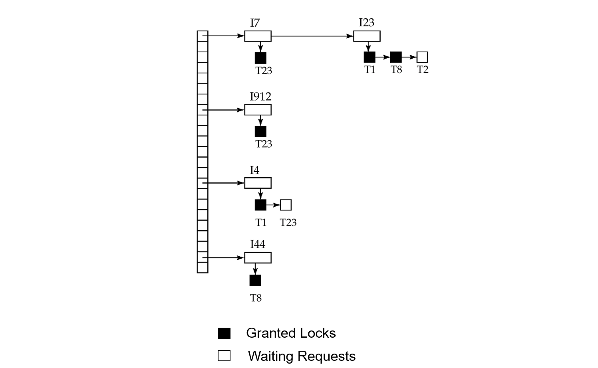
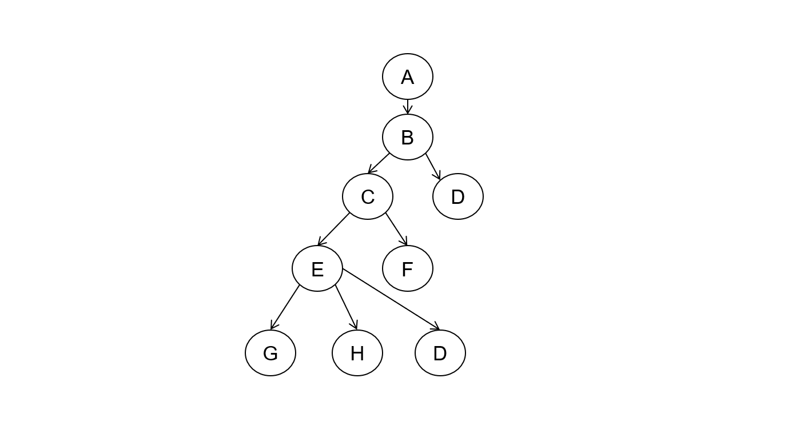

---
tags:
  - topic/database
  - project/database-system
Date: 2026-04-19
---
# 2. Concurrency Control
## 2.1. Lock-based Protocols

### 2.1.1. Lock-based Protocols

Locking Protocol은 Transaction의 동시성 제어를 위해 사용된다. 
Concurrent execution을 수행하면서도 Isolation과 Consistency를 충족하는 schedule을 생성하도록 한다.

- A **locking protocol** is a set of rules followed by all transactions while **requesting and releasing locks**. 
	- A **lock** is a mechanism **to control concurrent access** to a data item. 
	- Locking protocols restrict the set of possible schedules.
- Data items can be locked in two modes:
	- **Exclusive (X) mode**: can be **read as well as written** (do not necessarily have to be written)
	- **Shared (S) mode**: can be **read only**

##### Lock compatibility matrix:

|       | S     | X     |
| ----- | ----- | ----- |
| **S** | True  | False |
| **X** | False | False |
- S-lock은 다수의 transaction이 동시에 보유할 수 있다.
- X-lock은 한 개의 transaction에게만 허가된다.
##### Lock granting rules:

Transaction은 모든 읽기/쓰기 연산에 대하여 Lock 요청이 허가(granted)되어야만 연산을 진행할 수 있다.
이때 요청한 Lock이 다른 Transaction이 보유한 lock과 compatible해야만 Lock을 보유할 수 있다. (Lock Compatibility Matrix)
만약 Lock 요청이 거절되었다면 다른 Transaction의 lock이 release될 때까지 wait한다.

- Transaction can proceed **only after** request is granted
- A transaction may be granted a lock if the requested lock is **compatible** with locks already held by other transactions
	- Any number of transactions can hold **shared locks** on an item
	- If any transaction holds an **exclusive lock**, no other transaction may hold any lock on that item
- If a lock cannot be granted, the requesting transaction **waits** until all incompatible locks are released
	- The lock is then granted

##### Not sufficient to guarantee serializability

Lock Granting Rules를 준수하는 것만으로는 serializability를 보장할 수 없다.

```
lock-S(A)
read(A)
unlock(A)
----------- The data item can be updated
lock-S(B)
read(B)
unlock(B)
----------- The data item can be updated
display(A+B)
```

- well-formed schedule
	- `lock()`/`unlock()`이 모든 operation을 감싸는 형태

위와 같은 schedule에서 `read(A)`와 `read(B)` 사이에 A, B가 갱신되면 `display(A+B)`가 잘못된 값을 출력할 수 있다.

예를 들어, T1이 `read(A)` 후 `unlock(A)`를 하는 순간, 다른 Transaction T2가 A에 X-lock을 걸고 A를 갱신할 수 있다. 그 후 T1이 `read(B)`를 읽으면, T1은 **update 전의 A와 update 후의 B**를 더하게 된다. 이는 어떤 serial schedule과도 대응하지 않는 결과이다.

해당 Schedule은 well-formed이며 Lock compatibility 규칙도 준수하지만 Conflict Serializable하지 않다.

결국 "Lock을 언제 release하느냐"가 Serializability를 결정하는 핵심이다.
이를 해결하기 위해 Two-Phase Locking(2PL)이 필요하다.
- 모든 Lock 요청이 끝난 뒤에야 release를 시작하도록 강제하여 Conflict Serializability를 보장한다.

### 2.1.2. Two-phase Locking Protocol (2PL)

| **Phase 1<br>Growing phase**                                                  | **Phase 2<br>Shrinking phase**                                                |
| ----------------------------------------------------------------------------- | ----------------------------------------------------------------------------- |
| - Transaction may **obtain** locks<br>- Transaction may **not release** locks | - Transaction may **release** locks<br>- Transaction may **not obtain** locks |

Two-phase Locking Protocol은 Transaction이 일단 lock을 풀기 시작하면 Shrinking Phase에 들어간다.
Shrinking Phase에서는 새로운 lock을 잡을 수 없다. 
당연하게도 한번 release한 lock은 다시 획득할 수 없다.

- The protocol **assures Conflict Serializability**.
	- It can be proved that the transactions can be serialized in the order of their **lock points** 
	- (i.e., the point where a transaction acquired its final lock).

Lock Point란 Transaction이 **마지막 Lock을 획득하는 시점**이다. 이는 2PL에서 Serializability 순서의 기준이 된다.
**Lock Point**가 빠른 Transaction이 **Serial Order**에서 먼저 실행된 것으로 간주된다.

##### Two-phase Locking Protocol의 특성

- ✅ Ensures **conflict serializable** schedules
- ⚠️ There can be conflict serializable schedules **that cannot be obtained** if 2PL is used
	- 2PL $\rightarrow$ Conflict Serializable Schedules $\rightarrow$ correct
	- 2PL $\nleftarrow$ Conflict Serializable Schedules. 역은 성립하지 않는다.
- ⚠️ **Cascading rollback** is possible under 2PL 
	- T1이 write한 데이터에 대해 X-lock을 release하고, commit 전에 T2가 해당 값을 read할 수 있다. 
	- 이러한 경우 T1이 abort되면 T2도 rollback이 필요하므로 Cascading rollback이 발생한다.
- ❌ Does **not** ensure freedom from **deadlocks**

###### Cascading Rollback [(Recoverability - Cascading Rollback)](01-4-Recoverability)

하나의 Transaction이 실패(abort)했을 때, 그 Transaction이 write한 데이터를 읽은 다른 Transaction들도 연쇄적으로 rollback되어야 하는 현상이다. 

원인은 Dirty Read, 즉 아직 commit되지 않은 데이터를 읽는 것이다.

- To avoid: **Strict 2PL** 
	- a transaction must hold all its **exclusive locks** till it commits/aborts 
	- S-lock은 중간에 해제 가능
- Even stricter: **Rigorous 2PL**
	- **all locks** (S and X) are held till commit/abort. 
	- Transactions can be serialized in the order in which they commit.
	
| 방식           | X-lock 해제            | S-lock 해제            | Cascading Rollback (Dirty Read) |
| ------------ | -------------------- | -------------------- | ------------------------------- |
| 2PL          | Shrinking Phase 진입 시 | Shrinking Phase 진입 시 | 발생 가능                           |
| Strict 2PL   | commit/abort 시       | Shrinking Phase 진입 시 | 방지됨                             |
| Rigorous 2PL | commit/abort 시       | commit/abort 시       | 방지됨                             |
**Strict 2PL**은 commit 전까지 X-lock을 해제하지 않는 방식으로 **Dirty Read를 차단**하여 예방한다.

**Rigorous 2PL**은 X-lock 뿐만 아니라 S-lock도 commit/abort 시까지 유지한다. 이렇게 하면 다른 Transaction이 X-lock을 획득할 수 없으므로 중간에 값이 변경되지 않는다. 따라서 **Repeatable Read**가 보장된다. 즉, 같은 Transaction 내에서 동일한 데이터를 여러 번 읽었을 때 항상 같은 값을 읽게 된다. 
또한 Transaction들이 commit 순서대로 serialize된다. 모든 Lock을 commit까지 유지하므로, commit 순서가 곧 Serial Order이다.

| 방식           | Serial Order 기준 | 특징                                                       | Trade-off      |
| ------------ | --------------- | -------------------------------------------------------- | -------------- |
| 2PL          | Lock Point      |                                                          | 높은 Concurrency |
| Strict 2PL   | Lock Point      | Recoverability 보장<br>(Dirty Read, Cascading Rollback 방지) |                |
| Rigorous 2PL | Commit Order    | Read Stability 보장<br>(Repeatable Read)                   | 낮은 Concurrency |
Lock 해제를 commit/abort 시점으로 강제하면 일반 2PL에 비해 Lock을 오래 유지하게 된다. Dirty Read를 차단하여 예방할 수 있지만, 동시에 Concurrency가 낮아진다는 trade-off가 존재한다.
### 2.1.3. Lock Conversions

Two-phase locking(2PL) with lock conversions:

| **Phase 1<br>Growing phase**                                                                                                    | **Phase 2<br>Shrinking phase**                                                                                                    |
| ------------------------------------------------------------------------------------------------------------------------------- | --------------------------------------------------------------------------------------------------------------------------------- |
| - Transaction may **obtain** locks<br>- Transaction may **not release** locks<br>- Can convert lock-S → lock-X (**upgrade** ⬆️) | - Transaction may **release** locks<br>- Transaction may **not obtain** locks<br>- Can convert lock-X → lock-S (**downgrade** ⬇️) |
- This protocol assures **Conflict Serializability**.

기본 2PL에 Lock Conversion을 추가하여 이미 보유한 lock을 바꿀 수 있다.
Growing Phase에서는 lock-S를 lock-X로 변환하여 lock의 강도를 높일 수 있고, 
Shrinking Phase에서는 lock-X를 lock-S로 변환하여 lock을 약하게 풀 수 있다.

2PL의 Phase 규칙을 준수하고 있으므로 Conflict Serializability도 그대로 보장된다.
### 2.1.4. Why 2PL Ensures Conflict Serializability

**Proof by contradiction:**
1. Suppose 2PL $\nrightarrow$ Conflict Serializabiltiy.
	- 2PL이 Conflict Serializability를 보장하지 않는다고 가정한다.
2. Then there exists transactions $T_0, T_1, ..., T_n$ which obey 2PL and produce a non-serializable schedule.
	- 그렇다면 2PL을 따르면서 동시에 non-serializable한 스케줄이 존재할 것이다.
	- 이를  $T_0, T_1, ..., T_n$ 으로 표현한다. 순서를 가지는 Transaction의 집합이다.
3. A non-serializable schedule implies a **cycle** in the precedence graph.
	- non-serializable schedule은 precedence graph에 cycle이 존재한다.
	-  $T_0, T_1, ..., T_n$: 해당 스케줄을 precedence graph로 표현하면 cycle이 존재할 것이다.
4. $T_0 \to T_1 \to ... \to T_n \to T_0$ : 이와 같은 cycle이 존재한다고 가정하자.
5. Let $\alpha_i$ = the time at which $T_i$ acquires its **final lock** ($T_i$'s lock point).
	- 2PL을 따르는 각 Transaction에는 lock point가 존재한다. 
	- 해당 Transaction에서 마지막으로 lock을 획득한 시점을 의미한다.
6. **Key property:** For all $T_i \to T_j$ in the precedence graph, $\alpha_i < \alpha_j$.
	- 2PL에서 Lock Point는 Serial Order의 기준이 된다.
	- 즉, Lock Point가 빠른 Transaction이 먼저 실행된 것으로 간주한다.
7. For the assumed cycle: $\alpha_0 < \alpha_1 < ... < \alpha_n < \alpha_0$
	- 앞서 가정한 Cycle의 Transaction Order를 Lock Point Order로 변환할 수 있다.
	- $\alpha_0$ 로 시작하여 $\alpha_0$ 으로 끝나며, Key property를 위반한다.
8. $\alpha_0 < \alpha_0$ is a **contradiction**.
9. ∴ No such cycle can exist. **QED**

- Because $T_i \to T_j$ implies $\alpha_i < \alpha_j$, the lock point ordering is also a **topological sort** ordering of the precedence graph. Thus transactions can be serialized according to their lock points.

위 증명에 따라 2PL은 Conflict Serializability를 보장한다. 

또한 Lock Point 순서는 곧 Precedence Graph의 **Topological Sort** 순서와 같다. 
- [Topological Sort](01-3-How-to-Test-Serializability)란 cycle이 없는 그래프에서 모든 edge $T_i \rightarrow T_j$ 에 대해 $T_i$ 가 $T_j$ 보다 앞에 오도록 순서를 매기는 것이다. 즉, Partial Order를 가지는 Transaction에 대하여 Partial Order를 만족하면서 전체 Transaction을 정렬하는 방식이다. 
Lock Point 순서가 정확히 이 조건을 만족하므로, Lock Point 순서대로 Transaction을 나열하면 Valid한 Serial Order가 된다. 따라서 Lock Point 순서를 기준으로 Transaction을 serialize할 수 있다.

###### Key Property: $T_i \to T_j \implies \alpha_i < \alpha_j$

1. 2PL은 모든 Transaction에게 Lock Point라는 유일한 지점을 부여하고, Total Order를 생성한다.
2. 2PL의 Phase 규칙에 의해, 충돌하는 두 Transaction은 반드시 Lock Point 순서대로 실행된다.
	- Partial Order $\subset$ Total Order 강제
3. 따라서 Lock Point 순서대로 Transaction을 나열하면, Conflict 의존성을 모두 만족하는 Serial Order 중 하나가 도출된다.

| **명제**                                         | **성립 여부** | **의미**                                                                             |                          |
| ---------------------------------------------- | --------- | ---------------------------------------------------------------------------------- | ------------------------ |
| **$T_i \to T_j \implies \alpha_i < \alpha_j$** | **True**  | 2PL을 준수한다면 충돌하는 Transaction은 반드시 Lock Point 순서로 의존성이 생긴다.                          | 충돌하면 순서가 결정됨             |
| **$\alpha_i < \alpha_j \implies T_i \to T_j$** | **False** | 두 Transaction이 서로 무관한 데이터를 건드린다면 Lock Point가 앞서더라도 그래프상 Edge는 없다. 따라서 역은 성립하지 않는다. | 순서가 있다고 해서 반드시 충돌한 것은 아님 |
- **Transaction Conflicts $\implies$ Partial Order** 
- **Lock Point Order $\implies$ One of the valid Serial Orders** 
- **Serial Order $\supseteq$ Partial Order** 

Lock Point 순서는 모든 Serial Order의 기준이 된다. Lock Point가 빠른 Transaction이 먼저 실행된 것으로 간주한다. 반면 Transaction 간의 충돌 의존성은 Partial Order를 형성한다. 이러한 Partial Order를 모두 준수하는 Serial Order가 Conflict Serializable Schedule이다. 
2PL 프로토콜은 이 Partial Order가 반드시 Lock Point 순서를 따르도록 강제함으로써 Serializability를 보장한다. 하지만 충돌이 없는 Transaction들 사이에서도 Lock Point의 선후 관계는 결정된다. 따라서 Lock Point가 앞선다고 해서 반드시 데이터 충돌 의존성이 존재하는 것은 아니다. 따라서 해당 Property의 역은 성립하지 않는다.
 
### 2.1.5. Automatic Acquisition of Locks

상용 DBMS는 lock에 대한 제어를 사용자의 권한으로 운영하지 않는다. 
데이터 읽기 및 쓰기 연산에 관련되는 lock 관리는 DBMS의 고유 영역이다.
- 단, Isolation Level 설정을 통해 Lock들이 얼마나 유지될지 간접적으로 명령할 수는 있다.
##### `read(D)` is processed as:

```
If Ti has a lock on D
    then read(D);
else begin
    if necessary wait until no other transaction has a lock-X on D; // waiting queue
    grant Ti a lock-S on D;
    read(D);
end;
```

##### `write(D)` is processed as:
- 다른 Transaction이 어떤 lock도 보유하고 있지 않으며, 오직 $T_i$만 lock-S를 보유하고 있어야 upgrade가 가능하다.

```
If Ti has a lock-X on D
    then write(D)
else begin
    if necessary wait until no other transaction has any lock on D; // waiting queue
    if Ti has a lock-S on D
        then upgrade lock on D to lock-X   // upgrade
        else grant Ti a lock-X on D;
    write(D);
end;
```

Lock 요청이 거절된 Transaction들은 waiting queue에 들어가 대기한다. Lock이 해제되면 waiting queue에서 대기 중인 Transaction 중 하나가 lock을 획득한다.

이때 특정 Transaction이 영원히 원하는 lock을 획득하지 못하는 **Starvation**이 발생할 수 있다.
또한 여러 Transaction이 서로의 lock 해제를 기다리는 상황이 발생하면 **Deadlock**이 된다.
- DBMS는 이를 감지하기 위해 `Wait-for Graph`를 주기적으로 검사한다.

### 2.1.6. Implementation of Locking

**Lock Manager**는 lock 요청/해제를 전담하는 별도의 프로세스이다. 
Transaction은 직접 lock을 관리하지 않고 Lock Manager에게 요청을 보내고 응답을 기다린다.

- The lock manager replies with **lock grant messages** (or rollback requests in case of deadlock)
- The requesting transaction **waits** until its request is answered
- The lock manager maintains a **lock table** to record **granted locks** and **pending requests**
- The lock table is implemented as an **in-memory hash table** indexed on the data item name
##### Lock Manager Flow
1. Transaction이 lock 요청을 Lock Manager에게 전송
2. Lock Manager가 요청을 검토하여 허가 또는 대기 결정
3. Transaction은 응답이 올 때까지 대기
4. Deadlock이 감지되면 Lock Manager가 rollback requests 전송
##### Lock table 운영 방식
Lock Manager는 **In-memory Hash Table** 형태의 Lock Table을 유지한다. Data item 이름을 key로 인덱싱하여 현재 granted lock과 pending requests를 모두 관리한다.

- New request is added to the **end of the queue** for the data item, 
- and granted if compatible with all earlier locks
- **Unlock**: request deleted, later requests re-checked for granting
	- Unlock 시 해당 요청을 삭제하고, queue의 뒤에서 대기 중인 요청들을 재검토한다.
- If transaction **aborts**: all waiting or granted requests are deleted
	- Transaction이 abort되면 
	- 해당 Transaction의 granted/waiting 요청을 모두 삭제한다.



- Data Item I7: T23(granted)
- Data Item I23: T1, T8(lock-S granted), T2(lock-X waiting)
- Data Item I912: T23(granted)
- Data Item I4: T1(granted), T23(waiting)
	- (T1, T23): (lock-S, lock-X) | (lock-X, lock-S) | (lock-X, lock-X)
- Data Item I44: T8(granted)

### 2.1.7. [Deadlock](02-3-Deadlocks)

Deadlock은 두 개 이상의 Transaction이 서로 상대방이 보유한 lock이 해제되기를 기다리며 무한히 대기하는 상태이다.

|T3|T4|
|---|---|
|Lock-X(B)||
|Read(B)||
|Write(B)||
||Lock-S(A)|
||Read(A)|
|Lock-X(A) → **wait**||
||Lock-S(B) → **wait**|

Neither T3 nor T4 can make progress. 
- Executing Lock-S(B) causes T4 to wait for T3, 
- while executing Lock-X(A) causes T3 to wait for T4.

결국 T3는 T4를 기다리고, T4는 T3를 기다리는 **circular wait** 상태가 된다.

- Such a situation is called a **deadlock**. 
- **The potential for deadlock exists in most locking protocols. Deadlocks are a necessary evil.**

Lock을 사용하는 한 Deadlock을 원천적으로 완전히 없애기는 어렵다.
Concurrency를 허용하면서 동시에 Serializability를 보장하려면 lock이 필요하고, lock이 있는 한 Deadlock의 가능성은 항상 존재한다. 따라서 Deadlock을 **감지하여 해소**하는 방식으로 대처한다.
- e.g., Deadlock을 감지하면 victim 선정 후 rollback하여 해소한다.

### 2.1.8. Starvation

특정 Transaction이 lock을 획득하지 못하고 무한히 대기하는 상태이다. Deadlock과 달리 다른 Transaction들은 정상적으로 진행되지만, 특정 Transaction만 계속 대기한다.

##### Starvation 발생 원인
Starvation is also possible if concurrency control manager is badly designed:
1. S-lock의 연속적인 허가
	- $T_i$가 X-lock을 요청했는데, 다른 Transaction들이 계속해서 S-lock을 획득하는 상황이다.
	- X-lock은 S-lock과 incompatible하므로 $T_i$는 모든 S-lock이 해제될 때까지 기다려야 한다.
	- 그러나 S-lock 요청이 끊임없이 들어오면 $T_i$는 영원히 X-lock을 획득하지 못한다.
2. 반복적인 Deadlock으로 인한 Rollback
	- Deadlock 해소를 위해 Lock Manager가 특정 Transaction을 반복적으로 victim으로 선정하여 rollback시키면
	- 해당 Transaction은 계속 재시작되지만 진행하지 못한다.
	- The same transaction is repeatedly rolled back due to deadlocks

##### Starvation 해결 방법: FCFS/FIFO

Lock 요청이 들어온 순서대로 배정한다. (First Come, First Served)
X-lock을 기다리는 Transaction이 queue에 있으면 이후에 들어오는 S-lock 요청도 queue 뒤에 대기시킨다.
이렇게 하면 어떤 Transaction도 무한히 대기하지 않는다.

> **We cannot avoid deadlock, but should avoid starvation!!!**

데이터베이스 시스템에서 기아상태는 없어야 하며, 교착상태는 불가분하게 발생한다.

### 2.1.9. Graph-based Protocol

Graph-based protocols are an **alternative to 2PL**..
데이터 항목 간에 Partial Ordering을 미리 정의하고 이를 기반으로 lock을 관리하는 프로토콜이다.

데이터 항목들 사이에 접근 순서를 미리 정해두어, $d_i \to d_j$ 라면 두 데이터에 모두 접근하는 Transaction은 반드시 $d_i$에 먼저 접근해야 한다. 이 관계를 DAG(Directed Acyclic Graph)로 표현하여 Tree 구조로 단순화한 것이 Tree-based Protocol이다. B+ Tree와 같은 색인 구조는 자연스럽게 Top-down 방향의 partial ordering이 존재하므로 Tree-based Protocol을 적용하기에 적합하다.

- Impose a **partial ordering**
	- on the set $D = {d_1, d_2, ..., d_n}$ of all data items
	- $d_i \to d_j$ $\equiv$ any transaction accessing both must **access $d_i$ before $d_j$**
	- The set D can be viewed as a **directed acyclic graph** (called database graph)
	- acyclic graph $\rightarrow$ tree-based
- The **tree-based protocol** is a simple kind of graph-based protocol
	- 색인을 구성하는 데이터는 자연적으로 데이터 간 부분적인 순서가 존재한다. (Graph-based protocol)
	- Top-down으로 데이터에 접근하므로 partial ordering이 존재한다.
	- e.g. B+ Tree

##### Tree-based Protocol rules
1. Only **exclusive locks** are allowed
2. The **first lock** by $T_i$ may be on **any** data item
3. A data item Q can be locked by $T_i$ only if the **parent of Q** is currently locked by $T_i$
	- Q의 lock을 획득하기 위해서는 Q의 parent인 P의 lock도 쥐고 있어야 한다.
4. Data items may be **unlocked at any time**
5. A data item that has been locked and unlocked by $T_i$ **cannot be relocked** by $T_i$

 2PL과 달리, Tree-based Protocol은 Transaction이 lock을 해제하였다가도 이후 새로운 lock을 획득할 수 있다.
 다만 한번 lock을 획득하고 해제한 data item에 대해서는 다시 lock을 잡을 수 없다.

Phase 규약이 없기 때문에 lock을 일찍 해제할 수 있어 대기 시간이 짧고 Concurrency가 증가한다.
반면 한번 해제한 데이터는 다시 lock을 잡을 수 없어 무분별한 재획득을 방지한다.

###### Tree-based Protocol 예제
Parent의 lock을 획득해야 Child의 lock을 획득할 수 있으므로 항상 Top-down 순서로만 접근해야 한다.

- T1: `lock-X(B)` → `lock-X(C)` → `lock-X(D)` → `unlock(B)` → `unlock(D)` → `lock-X(E)` → `unlock(C)` → `unlock(E)`
	- `lock-X(C)`와`lock-X(D)`의 순서는 상관 없다.
	- Unlock은 언제든, 어떤 순서로든 가능하다. 다만 이후에는 해당 데이터의 자식 노드에 접근할 수 없다.
		- `unlock(B)`는 이미 자식인 `lock-X(C)`와 `lock-X(D)`의 lock을 획득하였으므로 유효하다.
		- `unlock(C)` 이후 `E`의 자식인 `G`, `H`에는 접근 가능하지만, `F`에는 접근할 수 없다. 
- T2: `lock-X(E)` → `lock-X(H)` → `unlock(E)` → `unlock(H)`
- T3: `lock-X(E)` → `lock-X(H)` → `unlock(H)` → `unlock(E)`
	- T2와 T3는 lock을 획득하는 데이터는 동일하나 lock을 해제하는 순서에만 차이가 있다.

##### Graph-Based Protocol 특징

Graph-based Protocol은 B+ Tree 같은 색인 구조에 특화되어 사용되며, 
DBMS 전체에 적용되는 2PL을 보완하는 역할을 한다.

- Ensures **conflict serializability** 
	- Partial Ordering으로 인해 Precedence Graph에 Cycle이 생길 수 없다.
	- 따라서 Conflict Serializability가 보장된다.
- **Freedom from deadlock** 
	- 데이터에 대한 록킹을 한쪽 방향으로만 허용하므로 교착상태가 발생하지 않음
- Unlocking may occur **earlier**
	- shorter waiting times, higher concurrency
- Schedules not possible under 2PL are possible under tree protocol, and **vice versa**
	- 2PL로는 생성 불가능하지만 Tree Protocol로는 가능한 스케줄이 존재한다.
	- Tree Protocol로는 생성 불가능하지만 2PL로는 가능한 스케줄도 존재한다.

**Drawbacks:**
-  Does **not** guarantee **recoverability or cascade freedom**
	- 2PL과 마찬가지로 commit 전에 write된 값을 읽는 Dirty Read가 발생할 수 있다.
	- Commit dependency 도입으로 해결할 수 있겠지
- Transactions may have to lock data items they **do not access** 
	- 자식 데이터에 접근하려면 반드시 부모 데이터의 lock을 획득해야 한다.
	- e.g., to access A and F, must also lock B, C 
	- → **increased locking overhead**, additional waiting time

###### 2PL vs. Tree-based Protocol 

두 프로토콜이 허용하는 스케줄 집합은 **어느 한쪽이 다른 쪽을 포함하는 관계가 아니라 부분적으로만 겹치는 관계**이다.

예를 들어 Tree Protocol은 unlock을 일찍 할 수 있어서 2PL의 Shrinking Phase 제약으로는 불가능한 스케줄을 만들 수 있다. 반대로 2PL은 X-lock과 S-lock을 모두 사용하지만 Tree Protocol은 X-lock만 허용하므로 2PL에서는 가능하지만 Tree Protocol에서는 불가능한 스케줄도 존재한다.

|                          | 2PL                | Tree-based Protocol   |
| ------------------------ | ------------------ | --------------------- |
| Conflict Serializability | O                  | O                     |
| Deadlock Freedom         | X                  | O                     |
| Recoverability           | △ (Strict 2PL로 해결) | X (별도 해결 필요)          |
| 불필요한 lock                | X                  | O (경로상 모든 노드 lock 필요) |
| Unlock 시점                | Shrinking Phase 이후 | 언제든 가능                |
