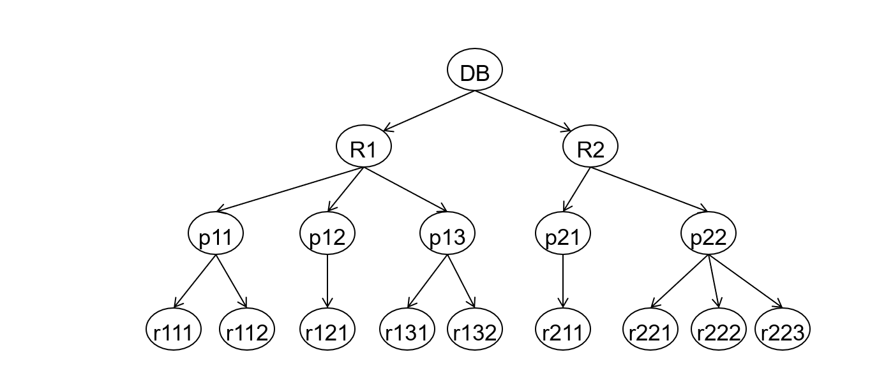
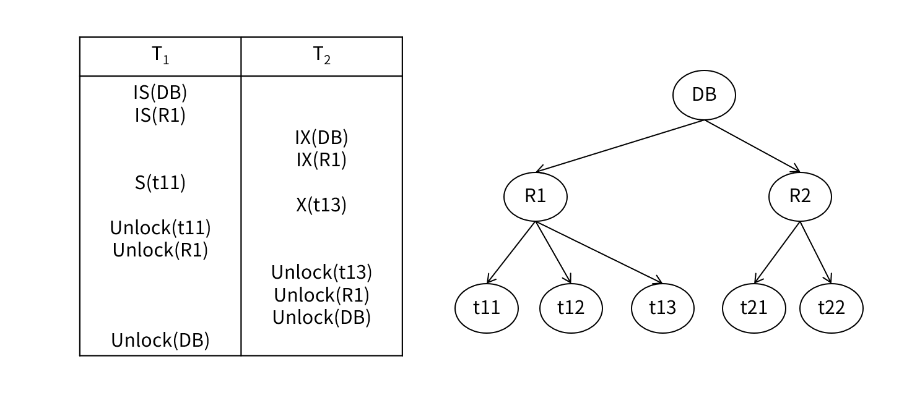
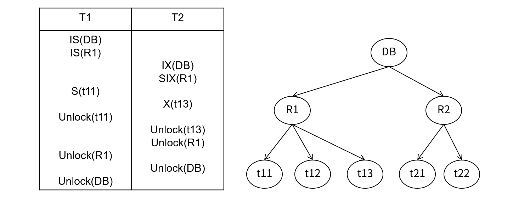
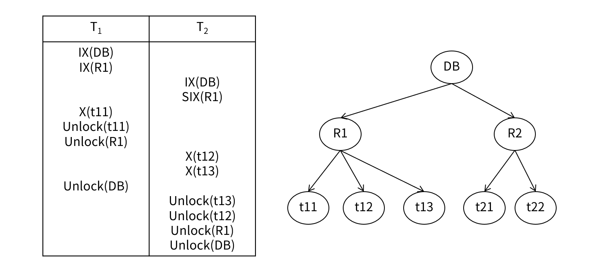

---
tags:
  - topic/database
  - project/database-system
Date: 2026-04-19
---
# 2. Concurrency Control
## 2.2. Multiple Granularity Locking

### 2.2.1. Multiple Granularity Locking

Multiple Granularity Locking은 lock을 걸 수 있는 데이터 단위(granularity)를 다양하게 허용한다.
예를 들어 단순히 tuple 단위로만 lock을 걸면, 테이블 전체를 수정하는 Transaction은 모든 tuple에 대해 개별적으로 lock을 걸어야 한다. 반대로 테이블 단위로만 lock을 걸면 동시성이 크게 낮아진다. 따라서 상황에 따라 적절한 granularity를 선택할 수 있도록 계층적 구조를 도입한다.

- Allow data items to be of **various sizes** and define a **hierarchy of data granularities**, 
- where **small granularities are nested within larger ones**. 
- Can be represented graphically as a tree.

##### Granularity Hierarchy (coarsest $\to$ finest)
```
DB → Relation/Table(File) → Page → Record(Tuple)
```
- 상위로 갈수록 granularity가 크고(coarse), 하위로 갈수록 작다(fine).
- Relation 대신 File을 사용할 수도 있다. File은 Relation보다 좀 더 물리적인 데이터 저장소이다.


Transaction이 임의 노드에 대하여 명시적으로(explicitly) 록을 잡으면 그 하위 노드에 대해서도 묵시적으로(implicitly) 록을 잡는 효과가 있다. 이를 통해 데이터에 접근할 때 locking overhead를 크게 줄일 수 있다. 
- vs. Graph/Tree based Protocol

##### Granularity tradeoff

|구분|Granularity|Concurrency|Locking Overhead|
|---|---|---|---|
|Fine (lower in tree)|작음 (tuple)|높음|높음|
|Coarse (higher in tree)|큼 (table/DB)|낮음|낮음|
- 소수의 table만 접근하는 Transaction 다른 Transaction과의 충돌을 최소화하는 Fine granularity 유리하다.
- 대량의 데이터에 접근하는 Transaction은 lock 횟수를 최소화하는 Coarse granularity가 유리하다.
### 2.2.2. Intention Lock Modes

Intention Lock은 MGL(Multiple Granularity Locking)에서 상위노드만 확인해도 하위 노드의 lock 상태를 파악할 수 있도록 미래의 lock 계획을 상위 노드에 미리 표시하는 메커니즘이다. 

**Why Intention Lock Modes?**
- MGL에서는 DB - Relation - Page - Record(Tuple) 계층 구조로 다양한 단위로 lock을 걸 수 있다.
- 만약 T1이 Table R1 전체에 S lock을 걸고 싶은데, T2가 이미 R1 안의 어떤 tuple에 X lock을 걸고 있다면?
- T1은 R1에 S lock을 걸 수 없다.
- 이때 Intention lock이 없다면 이 사실을 알기 위해 R1 하위 모든 tuple을 일일이 확인해야 한다.

In addition to S and X, three additional lock modes for MGL:

| 모드      | 이름                           | 의미                                                         |
| ------- | ---------------------------- | ---------------------------------------------------------- |
| **IS**  | Intention-Shared             | 하위 노드에서 **S**-lock을 걸 예정                                   |
| **IX**  | Intention-Exclusive          | 하위 노드에서 **X (또는 S)** lock을 걸 예정                            |
| **SIX** | Shared + Intention-Exclusive | 현재 노드 전체에 **S**-lock + 하위 일부에 **X**-lock 예정 (SIX = S + IX) |
- Intention Lock은 하위 노드에 lock을 걸기 전에, 상위 노드에 미리 구체적인 미래 lock mode를 표시한다.
- Intention locks allow a **higher-level node to be locked without having to check all descendant nodes**.
- 따라서 상위 노드만 확인해도 lock 충돌 여부를 알 수 있다.
	- T2가 R1의 tuple에 X lock을 걸 때, R1에 IX lock을 건다.
	- R1의 하위 노드에서 X lock을 걸 예정이라는 의미이다.
	- T1이 나중에 R1에 S lock을 요청하면, R1은 IX mode이므로 즉시 충돌을 감지한다.
		- R1에 하위에서 X lock을 획득하였으므로 R1 전체에 대한 S lock을 걸 수 없다.

###### SIX lock
SIX는 해당 노드 전체에 대하여 읽기 연산을 하고, 그 중 일부 데이터에 (이후에) X 록을 걸겠다는 의도이다. 
예를 들어 트랜잭션이 테이블 전체를 읽으면서 그 중 조건이 맞는 몇 개 레코드 값을 변경하고자 하는 연산에 적합하다.

### 2.2.3. Compatibility Matrix with Intention Lock Modes

 **"현재 노드에서"** 두 lock mode가 동시에 존재할 수 있는지를 판단한다.
 Intention Lock은 현재 노드에서 실제 read/write를 하지 않고 하위 노드에서의 lock 계획만 표시하므로, 충돌 판단이 하위 노드로 미뤄지는 경우가 많다. 

|         | IS  | IX  |  S  | SIX |  X  |
| ------- | :-: | :-: | :-: | :-: | :-: |
| **IS**  |  ✅  |  ✅  |  ✅  |  ✅  |  ❌  |
| **IX**  |  ✅  |  ✅  |  ❌  |  ❌  |  ❌  |
| **S**   |  ✅  |  ❌  |  ✅  |  ❌  |  ❌  |
| **SIX** |  ✅  |  ❌  |  ❌  |  ❌  |  ❌  |
| **X**   |  ❌  |  ❌  |  ❌  |  ❌  |  ❌  |

- **IS ∧ IX**
	- IS는 향후 하위에 S를, IX는 향후 하위에 X(또는 S)를 요구할 것임을 의미하므로, **현재 노드에서는 호환**된다. 
	- 동일 하위 노드에 S와 X가 동시에 걸리려 하면 그 때 충돌이 발생한다.
- **IX ∧ IX**
	- **현재 노드에서는 호환**된다. 
	- 향후 동일 하위 노드에 X 모드를 동시에 걸려고 하면 해당 노드에서 충돌이 발생한다.
- **IS ∧ SIX**
	- SIX = S + IX이며, IS는 S와 호환되고 IS는 IX와도 호환되므로, 호환된다.
- **SIX ∧ SIX**
	- SIX = S + IX
	- S와 IX는 호환되지 않는다.
### 2.2.4. MGL Scheme

-  MGL에서 노드에 lock을 걸기 위해서는 반드시 부모 노드를 먼저 적절한 mode로 잠가야 한다.
	- 어떤 노드에 **S 또는 IS** 록을 걸려면 → 부모가 **IS 또는 IX** 모드여야 함
	- 어떤 노드에 **X, SIX, IX** 록을 걸려면 → 부모가 **IX 또는 SIX** 모드여야 함
	- [Graph-based Protocol - 자식 노드에 접근하려면 반드시 부모 노드에 lock을 획득해야 한다.](02-1-Lock-based-Protocol)

- Lock 획득은 root $\to$ leaf 방향, 해제는 leaf $\to$ root 방향으로 이루어진다.
- 2PL을 준수해야 하므로 unlock을 시작하면 새로운 lock을 획득할 수 없고, 
- 자식 노드가 lock을 보유 중이면 부모 노드를 unlock할 수 없다.

Transaction $T_i$ can lock node Q using the following rules:

1. The **lock compatibility matrix** must be observed
2. The **root** must be locked first, and may be locked in **any mode**
3. Q can be locked in **S or IS** only if the parent of Q is locked by $T_i$ in **IX or IS** mode
4. Q can be locked in **X, SIX, or IX** only if the parent of Q is locked by $T_i$ in **IX or SIX** mode
5. $T_i$ is **two-phase** (cannot lock after unlocking any node)
6. Q can be **unlocked** only if none of Q's children are currently locked by $T_i$

- 상위 노드에서 SIX lock을 보유하고 있으면 하위 노드에는 IX 또는 X만 허용된다.
	- 상위에서 이미 S lock이 걸려 있으므로 하위에서 SIX를 걸면 S가 중복되기 때문이다.

###### Exercise 7: table A에 SIX lock을 걸기 위해 Database에는 어떤 lock mode?

- tableA에 SIX lock = S + **IX**
	- X 계열 의도가 포함된 강한 lock
- 부모 노드인 Database에는 IX 또는 SIX lock이 걸려 있어야 한다.
- 이때 MGL Scheme에 따르면
	- 상위 노드에서 SIX lock을 가지고 하위 노드에서 SIX lock을 요구하는 것은 S lock의 중복이므로 올바르지 않다.
- 따라서 database에는 IX lock을 설정해야 한다.
### 2.2.5. MGL Examples

##### Example 1 


→ No lock conflict between T1 and T2 — no waiting at all. 

- 만약 DB 레벨에 Intention Lock이 아닌 S lock을 걸었다면 R1에서 Conflict가 발생하고, Concurrency가 크게 저하됐을 것이다.
- Multiple Granularity Locking을 통해 tuple 단위로 lock을 세분화하여 동시성을 높였다.
- Lock을 해제하는 순서는 leaf $\to$ root이다. 2PL을 준수하므로 unlock을 시작하면 새로운 lock을 획득할 수 없다.
	- 2PL은 Shrinking Phase에만 unlock이 가능하나 순서는 상관 없다.
	- Graph-based/Tree-based Protocol은 unlock의 시점과 순서 모두 상관 없다.
##### Example 2 

→ IS ∧ SIX, no lock conflict

- IS ∧ SIX는 Compatibility Matrix에 따라 Compatible하다.
- T1은 tuple t11을 read하고, T2는 tuple t13을 write하므로 결과적으로 lock conflict가 발생하지 않는다.

##### Example 3


→ IX ∧ SIX, lock conflict 발생

- DB에서는 IX ∧ IX이므로 compatible하다.
- T2가 R1에 SIX 록을 요구할 때 T1이 IX를 보유 중이므로 lock conflict가 발생한다.
	- Transaction T2는 waiting queue에 들어가고, T2를 실행 중인 프로세스/스레드는 sleep 상태가 된다.
	- 이후 T1이 R1 lock 해제 하면 Lock Manager가 sleep 중인 T2를 wake up시키고, T2가 SIX lock을 획득한다 .
	
