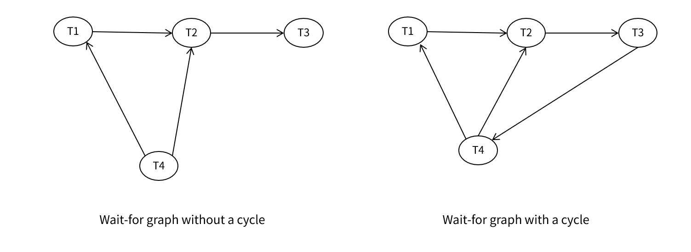

---
tags:
  - topic/database
  - project/database-system
Date: 2026-04-20
---
# 2. Concurrency Control
## 2.3. Deadlock

### 2.3.1. Deadlock Example

```
T1: write(X)      T2: write(Y)
    write(Y)          write(X)
```

Lock 기반 동시성 제어에서 Transaction은 데이터를 읽거나 쓰기 전에 반드시 Lock을 획득해야 한다. 

| T1                   | T2                   |
| -------------------- | -------------------- |
| Lock-X(X)            |                      |
| Write(X)             |                      |
|                      | Lock-X(Y)            |
|                      | Write(Y)             |
| Lock-X(Y) → **wait** |                      |
|                      | Lock-X(X) → **wait** |
- T1은 Y를 기다리는데 → Y는 T2가 보유
- T2는 X를 기다리는데 → X는 T1이 보유

>**System is deadlocked** if there is a set of transactions such that every transaction in the set is waiting for another transaction in the set.

Transaction 집합에서 모든 Transaction이 집합 내 다른 Transaction을 기다리고 있는 상태를 Deadlock이라고 한다.

###### Wait-for Graph
Deadlock은 Wait-for Graph에서 cycle이 생기면 발생한다.
```
T1 → T2   (T1이 T2를 기다림)
T2 → T1   (T2가 T1을 기다림)

→ 사이클 발생 = Deadlock!
```
### 2.3.2. Deadlock Handling

교착상태를 처리하는 방식은 크게 세 가지로 분류할 수 있다.
1. Timeout
2. Prevention
3. Detection
##### 1. Timeout-based Schemes
Transaction이 lock을 일정 시간 이상 기다리면 자동으로 Rollback한다. 구현이 단순하지만 특정 Transaction이 계속 Rollback되는 경우에는 Starvation이 발생할 수 있다. Timeout 방식은 분산 환경에서도 사용 가능하다.

다만 적절한 Timeout 값을 찾는 것은 어려운 일이다. Timeout이 너무 짧으면 Deadlock이 아닌데도 불필요하게 Rollback될 수 있으며, Timeout이 너무 길면 Deadlock 해결이 늦어질 수 있다.

- A transaction waits for a lock only for a **specified amount of time** → rolled back
- Simple to implement, but **starvation is possible**
- Difficult to determine good value of the timeout interval
##### 2. Deadlock Prevention Protocols
###### Predeclaration
실행 전 필요한 모든 lock을 미리 획득하는 방식이다. 하지만 Transaction이 실행되기 전에는 어떤 데이터에 접근할지 알 수 없기 때문에 실효성이 없다.
###### Graph-based (Tree Protocol)
데이터 접근 순서를 강제로 정하는 방식이다. 모든 Transaction이 같은 순서로 lock을 잡으면 circular wait 자체가 발생하지 않는다. 즉, Wait-for Graph에서 cycle이 나타나지 않는다.
###### Wait-die / Wound-wait Schemes
Transaction에 timestamp를 부여하고, lock 충돌 시 Timestamp를 기준으로 우선순위를 결정하는 방식이다.
Deadlock이 생길 수 있는 waiting 관계 자체를 제한하는 **prevention** 기법이다.

자세한 설명은 후술한다.

### 2.3.3. Wait-die / Wound-wait Schemes

> - Use **transaction timestamps** to prevent deadlock. 
> - A rolled back transaction is **restarted with its original timestamp** to avoid starvation.
> - Older transactions always have precedence.

- 두 방식 모두 **오래된 Transaction**이 우선권을 가진다.
	- 첫 번째 단어: 먼저 생성된 Transaction(older)이 취하는 형태
	- 두 번째 단어: 후에 생성된 Transaction(younger)이 취하는 형태
- Waiting 관계의 방향을 제한하여 deadlock cycle이 생기지 않게 한다.
- Restart 시 기존 Timestamp를 사용한다.
	- 새로운 Timestamp를 사용할 경우 언제나 Younger Transaction이 되어 Starvation이 발생할 수 있다.

##### 1. Wait-die scheme (Non-preemptive)

> **Older** transaction **waits** for younger one
> **Younger** transaction **dies (rolls back)** instead of waiting

Lock 충돌이 발생하면

| 기존 Transation                            | 새 Transaction |                                              |
| ---------------------------------------- | ------------- | -------------------------------------------- |
| Younger                                  | **Older**     | Younger Transaction이 Lock을 release할 때까지 Wait |
| Older                                    | **Younger**   | Waiting하지 않고 Die                             |
| 기존에 Lock을 보유한 Transaction은<br>상태 변화가 없다. |               |                                              |
- A transaction **may die several times** before acquiring needed data item
	- 같은 Transaction이 여러 번 rollback될 수 있다.

##### 2. Wound-wait scheme (Preemptive)

> **Older** transaction wounds (forces rollback of) younger one
> **Younger** transaction waits for older one


| 기존 Transaction                             | 새 Transaction          |                                            |
| ------------------------------------------ | ---------------------- | ------------------------------------------ |
| Younger                                    | **Older** (Preemption) | Younger Transaction을 abort시키고 Lock을 획득한다   |
| Older                                      | **Younger**            | Older Transaction이 Lock을 release할 때까지 Wait |
| Younger Transaction의 경우<br>강제로 상태 변화가 생긴다. |                        |                                            |
- May be **fewer rollbacks** than wait-die
	- Wait-die scheme과 다르게 Younger Transaction은 필요할 때만 죽는다.

### 2.3.4. Deadlock Detection

Detection 방식은 Prevention과 다르게 일단 시스템을 돌리다가 실제로 Deadlock이 생겼는지 검사하는 방식이다.

##### Wait-for Graph

- Deadlocks can be described as a **wait-for graph** $G = (V, E)$:

Wait-for Graph는 누가 누구를 기다리는지 그래프로 표현한 것이다. 
이 그래프에서 Cycle이 생긴다면 시스템은 Deadlock상태라는 결론을 내릴 수 있다.

> $V$: all transactions in the system
> $E$: Directed edge $T_i \to T_j$
> 	$T_i$ is waiting for $T_j$ to release a lock

시스템의 Transaction을 Waiting 상태를 표현하는 Directed Edge로 연결한다. 이때 화살표 방향은 기다리는 Transaction $\to$ 기다리게 만드는 Transaction이다. 

- Edge added when $T_i$ requests a data item held by $T_j$
- Edge removed when $T_j$ releases the data item

예를 들어, $T_i$ 가 $T_j$ 가 보유한 Lock을 요청하면 $T_i \to T_j$ Edge를 추가한다. 나중에 $T_j$가 Lock을 풀면 $T_i$는 더 이상 $T_j$를 기다리지 않게 된다. 따라서 $T_i \to T_j$ Edge를 제거한다.

즉 Wait-for Graph는 고정된 그래프가 아니라 시스템을 실행하며 Lock 요청/해제에 따라 계속 바뀌는 동적인 그래프이다. (Detection)

###### System is in DEADLOCK state $\equiv$  Wait-for Graph has a cycle

Wait-for Graph에 cycle이 있으면 Deadlock이다. 또한 Deadlock이라면 반드시 cycle이 존재한다.
Deadlock은 "서로 기다리는 닫힌 관계", 즉 순환 의존성이어야 성립한다. 만약 wait 관계가 직선처럼 이어져 끝에 있는 어떤 Transaction이 Lock을 풀 수 있다면 Deadlock이 아니다.

> **System is in deadlock state if and only if the wait-for graph has a cycle.** 
> Must invoke detection algorithm **periodically**.

따라서 Detection algorithm을 주기적으로 돌려야 한다.


- $T_2$, $T_3$, $T_4$ 사이에 cycle이 존재한다. → Deadlock (T2, T3, T4)
- $T_1$은 직접 cycle에 들어 있지는 않지만 연쇄적으로 영향을 받는 Transaction이다. (간접)
- 위 예시에서 $T_1$과 $T_4$가 모두 $T_2$를 기다리고 있다.

###### Wait-for Graph에서 노드의 Out-degree는 반드시 1인가?

> 임의 트랜잭션이 기다리는 록이 한 개 이상의 트랜잭션에 의해 공유될 수 있으므로, 한 개 이상의 트랜잭션을 기다릴 수 있다.

어떤 Data item A에 대해 $T_1$이 shared lock을 보유하고, $T_2$ 도 Shared Lock을 보유하고 있다고 가정하자. 이 상태에서 $T_4$가 exclusive lock을 요청하면, $T_1$, $T_2$ 모두를 기다리게 된다. 이때 $T_4$는 두 개의 Transaction을 가리키게 되며 $T_4 \to T_1$, $T_4 \to T_2$로 두 개의 Edge가 생긴다.
따라서 Wait-for Graph에서 한 노드의 out-degree는 1보다 클 수 있다.
### 2.3.5. Deadlock Resolution

Deadlock을 찾으면 풀어야 한다.

When deadlock is detected:

###### 1. **Select a victim** 
— roll back the transaction that incurs the **minimum cost**

- 비용이 가장 적은 쪽을 죽인다.
- 시스템 전체 손실을 최소화하는 것이 목적이다.
###### 2. **Total/partial rollback**
- **Total rollback**: abort and restart the transaction
    - Transaction 전체를 abort하고 처음부터 다시 시작한다.
    - 구현이 단순하지만 비용이 크다.
   - **Partial rollback**: roll back only as far as necessary to break deadlock 
    - Deadlock을 깨는 데 필요한 시점까지만 되돌린다.
    - Total Rollback에 비해 이미 진행한 작업을 더 적게 버리므로 효율적이다. 
    - 구현이 더 복잡하고, 어디까지 되돌릴지에 대한 관리가 필요하다.
###### 3. **Starvation prevention**
: include the **number of rollbacks** in the cost factor

- Deadlock이 생길 때마다 항상 같은 Transaction이 victim으로 선택되면 해당 Transaction은 계속 rollback만 되고 Starvation이 발생할 수 있다.
- 따라서 Victim Cost를 계산할 때 Rollback 횟수를 포함시킨다.
	- Rollback 횟수가 많을수록 비용을 크게 잡으면 다음에 다시 victim으로 선정될 가능성이 낮아진다.

상용 데이터베이스 시스템에서는 **current blocker**(Wait-for Graph에서 cycle을 완성하는 Wait를 제공하는 트랜잭션)를 철회하는 방식이 널리 쓰인다.

> **Lock waits are rare, deadlocks are (rare)² !!!**
