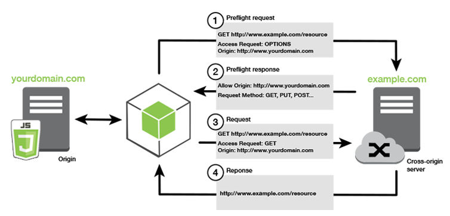
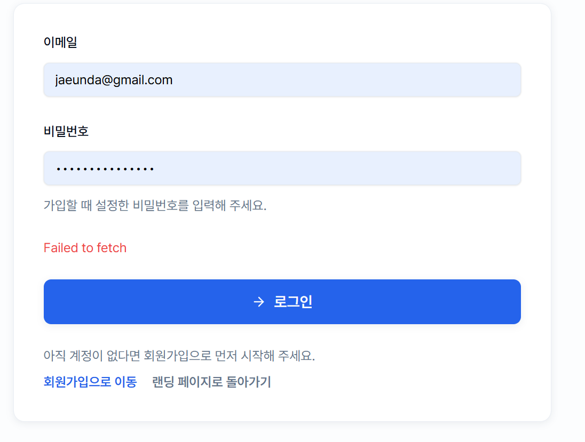

# CORS: Cross-Origin Resource Sharing
## What is Cross-Origin Resource Sharing?

> Cross-origin resource sharing (CORS) is a mechanism for integrating applications.
> CORS defines a way for client web applications that are loaded in one domain to interact with resources in a different domain.

CORS는 브라우저의 보안 정책으로, 다른 출처(origin)에서 오는 HTTP 요청을 제어하는 메커니즘이다.

> This is useful because complex applications often reference third-party APIs and resources in their client-side code.
> CORS allows the client browser to check with the third-party servers **if the request is authorized** before any data transfer.

실제 데이터를 전송하기 전에 **브라우저가 먼저 third-party 서버에게** 요청이 허용되는지 확인한다.
## Why is cross-origin resource sharing important?

> In the past, when internet technologies were still new, cross-site request forgery (CSRF) issues happened. These issues **sent fake client requests** from the victim's browser to another application.
> To prevent such CSRF issues, all browsers now implement the same-origin policy.

과거에는 CSRF(Cross-Site Request Forgery) 공격이 문제가 되었다. 예를 들어
1. 사용자가 은행 사이트에 로그인
2. 악성 사이트에서 사용자의 쿠키를 몰래 사용해 은행 서버에 요청 전송
3. 은행 서버는 정상 사용자 요청인 줄 알고 처리하여 피해 발생

이를 막기 위해 Same-Origin Policy를 도입했다.
#### Same-Origin Policy

> Today, browsers enforce that clients can only send requests to a resource with **the same origin as the client's URL**..
> **The protocol, port, and hostname of the client's URL**  should all match the server it requests.

Same-Origin Policy는 동일한 출처인 경우만 요청을 허용한다. 
이때 **프로토콜 + 도메인 + 포트**가 모두 같아야 동일 출처(Same-Origin)로 간주한다.

> For example, consider the origin comparison for the below URLs with the client URL `http://store.aws.com/dir/page.html`.

| URL                                         | Outcome          | Reason                                             |
| ------------------------------------------- | ---------------- | -------------------------------------------------- |
| `http://store.aws.com/dir2/new.html`        | Same origin      | Only the path differs                              |
| `http://store.aws.com/dir/inner/other.html` | Same origin      | Only the path differs                              |
| `https://store.aws.com/page.html`           | Different origin | Different **protocol**                             |
| `http://store.aws.com:81/dir/page.html`     | Different origin | Different **port** (http:// is port 80 by default) |
| `http://news.aws.com/dir/page.html`         | Different origin | Different **host**                                 |
- `http`와 `https`는 다른 프로토콜이므로 다른 출처(origin)로 간주한다.
- `http://store.aws.com`은 기본적으로 `80` 포트를 사용한다. `:81`은 포트 번호가 다르므로 다른 출처로 간주한다.
- `news.aws.com`은 도메인(host)가 다르므로 다른 출처로 간주한다.

Same-Origin Policy는 보안 측면에서 우수하지만, 외부 API, 외부 데이터 등 third-party 리소스를 사용할 수 없다는 한계가 있다. Third-party에 대한 접근을 허용하기 위해서는 same-origin policy를 확장한 CORS 정책이 필요하다.
동일한 출처 외에도 서버가 명시적으로 허용한 출처에 한하여 요청을 허용한다.
## How does cross-origin resource sharing work?

일반적으로 브라우저는 서버에 HTTP 요청을 보내고, 응답을 받아 화면에 표시한다. 이때 현재 브라우저의 URL을 current-origin, 요청 대상인 외부 URL을 cross-origin이라고 한다.

Cross-origin 요청이 발생하면 아래와 같은 순서로 진행된다.
1. 브라우저 $\to$ 서버
	- 브라우저가 요청에 `Origin` 헤더를 추가한다. 
	- 이 헤더에는 current-origin의 **프로토콜, 호스트, 포트** 정보가 담긴다.
2. 서버 $\to$ 브라우저
	- 서버가 `Origin` 헤더를 확인한다.
	- 요청한 데이터와 함께 `Access-Control-Allow-Origin` 헤더를 담아 응답한다.
3. 브라우저 $\to$ 클라이언트 앱
	- 브라우저가 응답 헤더를 확인한다.
	- 허용된 origin이면 데이터를 클라이언트 앱에 전달한다.
	- 만약 서버가 cross-origin 접근을 허용하지 않는다면 에러 메시지를 응답한다.

즉, **브라우저가 서버와 먼저 cross-origin의 허가 여부**를 주고받은 후에 실제 데이터를 전달받을 수 있다.

## What is a CORS preflight request?

일반적인 CORS 동작에서는 브라우저가 요청과 access control 헤더를 동시에 전달한다. 주로 GET과 같은 요청은 위험도가 낮기 때문이다.

하지만 일부 복잡한 요청은 **실제 요청을 전송하기 전에 먼저** 서버의 허가를 받아야 한다. 이러한 사전 허가 과정을 **preflight request**라고 한다.

> **Complex cross-origin requests**
> Cross-origin requests are complex if they use any of the following:
> 	- Methods other than GET, POST, or HEAD
> 	- Headers other than Accept-Language, Accept, or Content-Language
> 	- Content-Type headers other than `multipart/form-data`, `application/x-www-form-urlencoded`, or `text/plain`

데이터를 삭제하거나 수정하는 요청이 complex request의 대표적인 예이다.

Content Type이 `application/json`인 경우도 complex request에 해당한다. 따라서 REST API 요청은 거의 항상 preflight가 발생한다. (서버에서 CORS 설정을 제대로 해야 함.)

#### How preflight requests work
- Link: [AWS - What is a CORS preflight request?](https://aws.amazon.com/what-is/cross-origin-resource-sharing/#what-is-a-cors-preflight-request--17inh0i)

1. 브라우저 $\to$ 서버
	- 브라우저가 preflight request를 생성하고, 실제 요청 메시지를 보내기 전에 **접근 허용 여부 확인을 요청**한다.
	- Preflight request에는 cross-origin 정보와 서버에 요청하고자 하는 작업에 대한 정보(Method, Header)가 포함된다.
```
OPTIONS /data HTTP/1.1
Origin: https://example.com
Access-Control-Request-Method: DELETE
```
2. 서버 $\to$ 브라우저
	- 서버는 브라우저에게 서버가 허용하는 Origin, Method, Header를 응답한다.
		- `Access-Control-Allow-Methods`
		- `Access-Control-Allow-Headers`
		- `Access-Control-Allow-Origin`
```
HTTP/1.1 200 OK
Access-Control-Allow-Origin: https://news.example.com
Access-Control-Allow-Methods: GET, DELETE, HEAD, OPTIONS
Access-Control-Allow-Headers: Content-Type
```
3. 브라우저 $\to$ 서버
	- Preflight 통과 후에 실체 요청이 전송된다.
##### Access-Control-Max-Age

>The preflight response sometimes includes an additional Access-Control-Max-Age header. This metric **specifies the duration (in seconds) for the browser to cache preflight results** in the browser. Caching allows the browser to send several complex requests between preflight requests. It **doesn’t have to send another preflight request until the time specified** by max-age elapses.

서버 응답에 `Access-Control-Max-Age` 헤더가 포함되면, 브라우저는 preflight 결과를 지정된 시간 동안 캐시한다. 따라서 같은 요청을 반복할 때 새로운 preflight request를 보내지 않아도 된다.

## What are some CORS best practices?

서버에서 CORS 설정 시 다음과 같은 사항을 유념해야 한다.
#### 1. Define appropriate access lists

>Avoid using wildcards unless you want to make the API public. 
>Otherwise, using wildcards and regular expressions may create vulnerabilities.

와일드카드(`*`)나 정규 표현식(regular expression) 사용은 보안 상 취약할 수 있으므로 피하는 것이 좋다.
예를 들어 `*.permitted-website.com`을 허용하면 `maliciouspermitted-website.com`도 허용될 수 있다.
따라서 실제로 사용하는 출처만 명시적으로 열어두는 것이 좋다.

참고로 쿠키, 세션과 같은 인증 정보를 포함한 요청은 `allowCredentials(true)`를 사용한다. 이는 와일드카드와 함께 사용할 수 없으므로 반드시 출처를 명시해야 한다.

#### 2. Avoid using null origin in your list

파일 요청 또는 local host의 요청 등 일부 상황에서 브라우저가 `null`을 Origin으로 보내는 경우가 있다.
하지만 `null`을 허용 목록에 넣으면 의도치 않은 접근이 허용될 수 있으므로 피해야 한다.

# In Practice
## PR: CORS `setAllowedOrigins` 추가
- Link: [Team-po/Server - Refactor: www.team-po.cloud CORS 허용 Origin 추가](https://github.com/Team-po/Server/pull/49#pullrequestreview-4216160624)
##### Problem
 기존 `CorsConfigurationSource`의 `setAllowedOrigins` 리스트에는 로컬 개발 origin과 `https://team-po.cloud`만 등록되어 있었다.
 
`https://www.team-po.cloud`로 접속 자체는 가능하지만, 해당 Origin에서 발생하는 REST API 호출은 **CORS 허용 목록에 없기 때문에** Preflight 요청과 인증이 포함된 요청이 컨트롤러에 도달하기 전인 브라우저/보안 필터 단계에서 차단된다. 서버 API 자체는 정상이어도 프론트엔드에서는 로그인, 회원가입, 데이터 조회 같은 요청이 CORS 에러로 실패한다.



##### Changes
`setAllowedOrigins` 리스트에 `https://www.team-po.cloud`를 추가하였다.
##### Why This Approach
해당 서비스는 JWT를 `Authorization` 응답 헤더로 전달하며, Cross-Origin 환경에서 클라이언트가 이 헤더를 읽을 수 있도록 `setExposedHeaders`와  `allowCredentials(true)`를 함께 사용한다. 이 경우 와일드카드 방식을 사용할 수 없으므로 필요한 origin을 명시적으로 추가하는 방식을 선택했다.

```
configuration.setAllowedOrigins(List.of(
			"http://localhost:5173",
			"http://localhost:3000",
			"https://team-po.cloud",
			"https://www.team-po.cloud"
		));
		configuration.setAllowedMethods(List.of("GET", "POST", "PUT", "PATCH", "DELETE", "OPTIONS"));
		configuration.setAllowedHeaders(List.of("Authorization", "Content-Type", "Accept"));
		configuration.setExposedHeaders(List.of("Authorization"));
		configuration.setAllowCredentials(true);
		configuration.setMaxAge(3600L);
```
#### References
- [MDN - Cross-Origin Resource Sharing](https://developer.mozilla.org/en-US/docs/Web/HTTP/Guides/CORS)
- [AWS - What is CORS?](https://aws.amazon.com/what-is/cross-origin-resource-sharing/)
