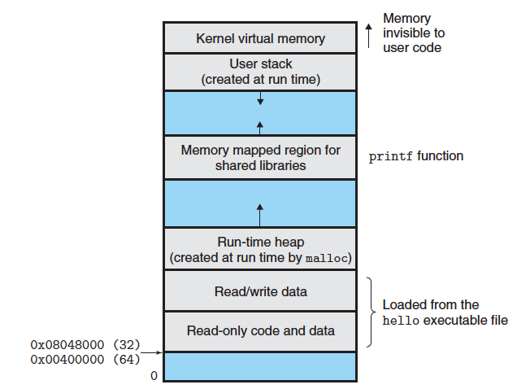

---
tags:
  - topic/operating-system
  - topic/linux-kernel
  - project/csocrates2
Date: 2026-06-23
featured: true
pinOrder: 1
---
운영체제는 물리 CPU, 물리 메모리, 디스크처럼 한정된 자원을 여러 프로그램이 함께 쓰게 만든다. 이때 메모리에 적용되는 가상화가 **메모리 가상화(memory virtualization)** 이다. **프로세스는 자기만의 연속된 메모리를 쓰는 것처럼 실행**되지만 실제 물리 메모리는 다른 프로세스와 공유하며 운영체제와 하드웨어가 그 대응 관계를 유지한다.

초기의 시스템은 메모리 안에 운영체제와 실행 프로그램 하나만 두면 됐다. 그러나 멀티프로그래밍과 시분할이 등장하면서 입출력을 기다리는 프로세스를 멈춰 둔 채 다른 프로세스를 실행하는 편이 CPU 활용률과 응답성을 높였다. 이 방식이 성립하려면 프로세스를 전환할 때마다 메모리를 통째로 디스크에 내리고 다시 읽어 오는 대신 여러 프로세스의 상태를 메모리에 남겨 두어야 한다. 그 순간 **공유하는 물리 메모리를 서로 침범하지 않고 사용하게 만드는 문제**가 생긴다.

## 1. 왜 주소 공간이 필요한가

- Multi Programming: 한 프로세스가 입출력을 기다릴 때 다른 프로세스를 실행해 CPU가 놀지 않게 하려는 방식
- Time Sharing: 각 프로세스가 짧게 실행하고 양보한 뒤, 다른 프로세스가 다시 짧게 실행

멀티프로그래밍의 목적은 CPU가 입출력 때문에 놀지 않게 하는 것이다. 프로세스 A가 디스크나 네트워크 I/O를 기다리는 동안 운영체제는 프로세스 B를 실행한다. Time Sharing은 여기에 짧은 실행 시간 단위와 빠른 전환을 더해, 여러 사용자가 하나의 시스템을 동시에 쓰는 것처럼 보이게 한다.

하지만 프로세스들을 단순한 물리 주소만으로 메모리에 함께 올려 두면 두 문제가 생긴다.

1. **배치(placement)**: 프로그램이 물리 메모리의 어느 위치에 올라가야 하는가?
2. **보호(protection)**: 한 프로세스가 다른 프로세스나 커널의 메모리를 읽고 쓰지 못하게 어떻게 막는가?

여러 프로그램이 물리 메모리에 동시에 올라가 있으면, 한 프로그램이 다른 프로그램의 메모리를 읽거나 덮어쓸 수 있고 운영체제도 보호받지 못할 수 있다. 즉, 여러 프로세스를 동시에 유지하려면 단순히 메모리를 나눠 주는 것만으로는 부족하고 각 프로세스가 서로를 침범하지 못하게 해야 한다.

이 요구를 푸는 추상화가 **주소 공간(Address Space)** 이다.

- **프로세스가 보는 것**: 0번지부터 시작하는 연속된 전용 메모리 주소 공간
- **하드웨어와 OS가 하는 일**: 그 주소 공간을 실제 물리 메모리의 임의 위치에 나누어 배치하고 접근을 검사

각 프로세스는 자신의 code, stack, heap이 들어 있는 연속된 주소 범위를 가진다고 믿는다. 실제 물리 프레임은 서로 떨어져 있을 수 있고 그 매핑은 프로세스마다 다를 수 있다.

### 1.1. 메모리 가상화의 목표

|목표|의미|
|---|---|
|**Transparency**|프로그램은 실제 물리 메모리 배치나 재배치 과정을 몰라도 된다.|
|**Efficiency**|주소 변환과 메모리 관리가 시간·공간 측면에서 과도한 비용을 만들지 않아야 한다.|
|**Protection**|프로세스는 자신에게 허용된 주소와 권한 안에서만 접근해야 한다.|

보호의 핵심은 **isolation(고립)** 이다. 한 프로세스가 잘못 동작해도 다른 프로세스와 운영체제까지 함께 망가지지 않아야 한다. 주소 공간은 "각자 다른 메모리를 가진다"는 편의만 제공하는 것이 아니라 이 고립을 만드는 경계이기도 하다.

### 1.2. 두 프로세스가 같은 가상 주소를 독립적으로 쓴다

각 프로세스가 `malloc()`으로 얻은 주소와 그 주소에 저장한 값을 출력해 볼 수 있다. 두 인스턴스를 동시에 실행했을 때 주소가 같게 보일 수도 있고 ASLR(Address Space Layout Randomization) 때문에 다르게 보일 수도 있다. 어느 경우든 한 프로세스의 `*p` 증가가 다른 프로세스의 값에 영향을 주지 않는 것이 핵심이다.

H:\My Drive\obsidian\eunda\04-Archives\csocrates2-os\memory-virtualization-linux.md- **Address Space Layout Randomization(ASLR)**: 실행할 때마다 스택·힙·공유 라이브러리·실행 코드 등의 시작 주소를 무작위로 바꾸는 보안 기법이다. 공격자가 특정 주소를 미리 예측해 악용하기 어렵게 만든다. 그래서 같은 프로그램을 여러 번 실행해도 관찰되는 가상 주소가 매번 달라질 수 있다.

```c
// mem_isolation.c
#include <stdio.h>
#include <stdlib.h>
#include <unistd.h>

int main(void)
{
    int *p = malloc(sizeof(*p));
    if (p == NULL) {
        perror("malloc");
        return 1;
    }

    *p = 0;
    printf("pid=%ld, p=%p\n", (long)getpid(), (void *)p);

    for (int i = 0; i < 5; i++) {
        sleep(1);
        (*p)++;
        printf("pid=%ld, *p=%d\n", (long)getpid(), *p);
    }

    free(p);
    return 0;
}
```

```bash
$ gcc -Wall -Wextra -O0 mem_isolation.c -o mem_isolation
$ ./mem_isolation & ./mem_isolation &
```

|함수 시그니처|역할|RETURN VALUE|
|---|---|---|
|`pid_t getpid(void);`|현재 프로세스의 PID 조회.|성공: 현재 프로세스 PID. 오류 반환 없음.|
|`unsigned int sleep(unsigned int seconds);`|최대 `seconds`초 동안 실행을 중단.|정상 완료: `0` / 신호로 중단: 남은 초 수|

### 1.3. Example: Linux Kernel

- `include/linux/mm_types.h`: 프로세스의 메모리 컨텍스트인 `struct mm_struct`, 주소 범위 단위인 `struct vm_area_struct`
- `kernel/fork.c`: 새 태스크를 만들 때 메모리 컨텍스트를 복제·공유하는 `copy_mm()`
- `fs/exec.c`: 새 실행 파일을 적재하며 기존 주소 공간을 교체하는 실행 경로

## 2. 프로세스가 보는 가상 주소 공간

**주소 공간**은 운영체제가 실행 중인 프로그램에게 보여 주는 메모리의 모습이다. 실제 물리 메모리가 어떻게 배치되어 있든 프로세스는 자기 주소 공간을 대체로 낮은 주소에서 높은 주소로 이어지는 하나의 연속 공간처럼 다룬다. (참고: 실제 배치는 ELF 형식, 로더, 라이브러리, ASLR, 아키텍처와 커널 설정에 따라 달라진다.)


|영역|주된 내용|성격|
|---|---|---|
|**Text / Code**|실행 명령어|읽기·실행, 여러 프로세스가 공유 가능|
|**`.rodata`**|문자열 리터럴 등 읽기 전용 초기화 데이터|읽기 전용|
|**Data**|초기화된 전역·정적 변수|읽기·쓰기|
|**BSS**|초기화되지 않은 전역·정적 변수|실행 시 0으로 초기화|
|**Heap**|`malloc()` 계열로 얻는 동적 메모리|보통 높은 주소 방향으로 성장|
|**Memory-mapped 영역**|공유 라이브러리, 파일 매핑, 익명 매핑|파일 기반 또는 익명 영역|
|**User Stack**|호출 프레임, 지역 변수, 반환 주소|보통 낮은 주소 방향으로 성장|
|**Kernel 영역**|커널 코드·데이터|사용자 모드 접근 금지|

힙과 스택이 양 끝에서 반대 방향으로 자라면 실행 중 어느 쪽이 더 커질지 미리 알 수 없어도 가운데의 빈 공간을 유연하게 사용할 수 있다. 다만 둘이 충돌할 정도로 커지면 주소 공간 자체가 부족해진다.

### 2.1. Code/Global/Heap/Stack은 서로 다른 주소 범위에 놓인다

프로그램이 포인터 값으로 확인하는 주소는 물리 주소가 아니라 가상 주소다. Code/global/heap/stack  주소를 출력해 보면 서로 다른 주소 범위에 놓인다는 것을 확인할 수 있다.

```c
#include <stdio.h>
#include <stdlib.h>

int main(void) {
    int x = 3;

    printf("location of code  : %p\n", (void *)main);
    printf("location of heap  : %p\n", malloc(1));
    printf("location of stack : %p\n", (void *)&x);
    return 0;
}
```

Code가 비교적 낮은 주소에, heap이 그 위쪽에, stack이 반대편 높은 주소에 찍힐 수 있다. 이 값들은 모두 프로그램이 관찰하는 **가상 주소**이다. 실제 물리 메모리의 어느 프레임에 존재하는지는 운영체제와 하드웨어가 주소 변환을 통해서만 안다. 각 영역의 권한과 파일 매핑 여부는 `/proc/<pid>/maps`에서 직접 확인할 수 있다. (실행 환경과 ASLR 때문에 절대 주소는 매번 달라질 수 있다.)
### 2.2. Data, BSS, rodata를 구분하는 이유

같은 global/static 변수라도 초기화 여부와 읽기 전용 여부에 따라 실제로 놓이는 영역이 달라진다. 아래 코드는 변수마다 어느 영역으로 가는지를 보여 준다.

```c
#include <stdlib.h>

int        g_init   = 10;   // 초기화된 전역       → Data
int        g_uninit;        // 초기화되지 않은 전역 → BSS
static int s_init   = 5;    // 초기화된 정적       → Data

int main(void) {
    static int s_uninit;          // 초기화되지 않은 정적 → BSS
    int        local = 3;         // 지역 변수            → Stack
    int       *heap  = malloc(16); // 동적 할당            → Heap
    (void)local; (void)heap;
    return 0;
}
```

```bash
$ gcc -Wall -Wextra -O0 -g layout_demo.c -o layout_demo
$ size layout_demo
$ readelf -S layout_demo | grep -E '\.(text|rodata|data|bss)'
```

| 추가한 변수                                | 늘어나는 영역  |
| ------------------------------------- | -------- |
| 초기화된 global/static 변수 (`int g = 10;`) | **data** |
| 초기화되지 않은 global/static 변수 (`int g;`)  | **bss**  |

위 코드는 초기화된 global/static 변수를 늘리면 `data`가, 초기화되지 않은 global/static 변수를 늘리면 `bss`가 증가하는 것을 보여 준다. BSS는 실행 파일에 초기값을 실제로 저장할 필요가 없다. "이만큼의 0으로 초기화된 공간이 필요하다"는 크기 정보만 기록해 두면 되므로 초기화되지 않은 global/static 변수를 효율적으로 다룰 수 있다.

같은 초기화된 데이터라도 읽기 전용인지에 따라 다시 나뉜다.

```c
const char *str = "hello world";
char        text[] = "hello world";
```

- 문자열 리터럴 `"hello world"`는 바뀔 일이 없으므로 읽기 전용 영역(`.rodata`)에 놓인다.
- 포인터 변수 `str`은 실행 중 다른 문자열을 가리키도록 바뀔 수 있으므로 읽기·쓰기 영역(`.data`)에 놓일 수 있다.
- 배열 `text`는 원소를 수정할 수 있으므로 읽기·쓰기 데이터 영역에 놓인다.

### 2.3. Example: Linux Kernel

- `fs/binfmt_elf.c`: ELF 실행 파일의 프로그램 헤더를 읽고 매핑하는 `load_elf_binary()`
- `mm/mmap.c`: 새 VMA를 만들고 주소 공간에 배치하는 `do_mmap()` 계열
- `fs/proc/task_mmu.c`: `/proc/<pid>/maps`, `smaps` 같은 메모리 관찰 인터페이스
- `include/linux/mm_types.h`: VMA의 시작·끝 주소, 권한, 파일 연결 정보를 담는 `struct vm_area_struct`

## 3. Memory API

사용자 프로그램은 `malloc()`과 `free()`로 동적 메모리를 다룬다. 그러나 `malloc()`은 시스템 콜이 아니라 **사용자 공간 allocator의 라이브러리 함수**다. allocator는 이미 확보한 heap 또는 anonymous 매핑 내부에서 요청에 맞는 블록을 관리하고 부족할 때에만 커널에 주소 공간을 더 요청한다.

프로그래머 관점에서 동적 메모리는 단순하다. 필요한 크기를 `malloc()`으로 받고 더는 필요하지 않으면 `free()`로 돌려준다. 어디에 어떤 물리 메모리가 배정되는지는 신경 쓰지 않는다. 이것이 API가 제공하는 추상화다.

- **anonymous(익명)**: 특정 파일과 연결되지 않은 메모리 영역이다. `mmap(..., MAP_ANONYMOUS, ...)`로 직접 만들 수 있으며, heap·stack·BSS처럼 파일의 내용을 읽어 올 필요 없이 프로그램이 사용할 데이터를 저장하는 영역에도 사용된다.
	- 파일 백업이 없으므로 페이지에 처음 접근하면 운영체제는 논리적으로 0으로 초기화된 페이지를 제공한다.
	- 이후 내용은 메모리에만 존재하며 일반적으로 swap 영역을 제외하면 파일로부터 다시 복원할 수 없다.

### 3.1. 기본 API와 반환값

```c
#include <stdlib.h>

void *malloc(size_t size);                 // size 바이트 할당, 초기값 미정의
void *calloc(size_t nobj, size_t size);    // nobj*size 바이트 할당 후 0으로 초기화
void *realloc(void *ptr, size_t newsize);  // 기존 블록을 newsize로 조정
void  free(void *ptr);                      // 블록 해제
```
```
RETURN VALUE
   malloc / calloc / realloc : 성공 시 할당 영역의 포인터, 실패 시 NULL
   realloc 실패 시 기존 ptr 은 그대로 유효하게 남는다
   free : 반환값 없음
```

`malloc()`이 돌려준 메모리의 내용은 정의되어 있지 않으므로 곧바로 읽지 말고 직접 초기화해야 한다. `calloc()`은 할당과 동시에 0으로 채워 준다. `realloc()`의 `new_size`는 "추가로 필요한 크기"가 아니라 **최종적으로 원하는 전체 크기**다. 또한 `realloc()`의 반환값을 곧바로 기존 포인터에 대입하면 실패 시 기존 포인터를 잃어버릴 수 있으므로 임시 포인터를 사용해야 한다.

```c
// safe_alloc.c
#include <stdio.h>
#include <stdlib.h>

int main(void)
{
    size_t count = 4;
    int *numbers = calloc(count, sizeof(*numbers));
    if (numbers == NULL) {
        perror("calloc");
        return 1;
    }

    for (size_t i = 0; i < count; i++)
        numbers[i] = (int)i;

    size_t new_count = 8;
    int *tmp = realloc(numbers, new_count * sizeof(*numbers));
    if (tmp == NULL) {
        free(numbers); // 기존 영역은 여전히 유효하므로 직접 해제
        perror("realloc");
        return 1;
    }
    numbers = tmp;

    for (size_t i = count; i < new_count; i++)
        numbers[i] = (int)i;

    for (size_t i = 0; i < new_count; i++)
        printf("%d ", numbers[i]);
    puts("");

    free(numbers);
    return 0;
}
```

### 3.2. 일반적인 메모리 오류

|실수|의미|흔한 결과|
|---|---|---|
|할당하지 않은 포인터 사용|유효한 객체가 없는 주소에 접근|`SIGSEGV` 또는 데이터 훼손|
|부족하게 할당|특히 문자열 끝 `\0` 공간 누락|buffer overflow|
|초기화하지 않은 값을 읽음|`malloc()` 결과를 곧바로 읽음|미정의 값, 보안 문제 가능성|
|해제 누락|더 이상 쓰지 않는 블록을 유지|memory leak|
|use-after-free|해제한 뒤 이전 포인터로 접근|dangling pointer, 훼손|
|double free / invalid free|같은 블록 두 번 해제하거나 잘못된 포인터 해제|미정의 동작, 크래시 가능|

이 오류들은 "메모리를 받은 범위 안에서만 쓰고 소유권이 끝났을 때 한 번만 돌려준다"는 약속이 깨졌을 때 생긴다. 가상 메모리는 프로세스 간 보호를 제공하지만 같은 프로세스 내부의 잘못된 포인터 사용까지 자동으로 모두 막아 주는 것은 아니다.

### 3.3. allocator와 `brk`와 `mmap`

`malloc()` 호출은 사용자 공간의 메모리 할당기(allocator)가 먼저 처리한다. allocator는 커널에서 미리 확보해 둔 비교적 큰 메모리 영역을 요청 크기에 맞는 작은 블록으로 나누어 반환한다. 기존 영역에서 더 이상 할당할 공간을 찾기 어렵거나 부족해지면 그때 `brk()` 또는 `mmap()` 등을 통해 커널에 추가 가상 주소 공간을 요청한다.

```c
#include <unistd.h>

int   brk(void *addr);            // 힙 끝(break)을 addr로 설정
void *sbrk(intptr_t increment);   // 힙을 increment만큼 증감
```
```
 RETURN VALUE
   brk  : 성공 0 / 오류 -1, errno 설정
   sbrk : 성공 시 "이전" break 주소 / 오류 (void *)-1, errno 설정
```

`brk()`와 `sbrk()`는 프로세스의 힙 영역 경계를 조정하는 인터페이스이며 사용자 공간 allocator가 메모리를 확보하는 방식을 이해하기 위해 살펴볼 수 있다. 일반 애플리케이션은 이들을 직접 호출하기보다 `malloc()`/`free()`와 같은 allocator 인터페이스를 사용한다. allocator는 필요할 때 힙 영역을 비교적 크게 확장한 뒤 확보한 영역을 요청 크기에 맞는 작은 블록으로 나누어 여러 `malloc()` 요청에 배분한다.

```c
void *prev = sbrk(0);             // 현재 break 위치 확인
void *base = sbrk(64 * 1024);     // 힙을 64KB 확장
// base ~ base + 64KB 영역을 allocator가 작은 블록으로 분할한다.
```

```c
#include <sys/mman.h>

void *mmap(void *addr, size_t len, int prot, int flag, int fd, off_t off);
int   munmap(void *addr, size_t len);
```
```
 RETURN VALUE
   mmap   : 성공 시 매핑 시작 주소 / 오류 MAP_FAILED, errno 설정
   munmap : 성공 0 / 오류 -1, errno 설정
```

비교적 큰 메모리 할당은 allocator가 `mmap()`을 이용해 처리하는 경우가 많고 공유 라이브러리나 파일을 주소 공간에 올릴 때도 `mmap()` 방식의 파일 매핑이 사용된다. `mmap()`은 파일과 연결되지 않은 anonymous 영역을 만들 수도 있고 파일의 내용을 프로세스 주소 공간에 매핑할 수도 있다. 이때 `PROT_READ`, `PROT_WRITE`, `PROT_EXEC`으로 접근 권한을 `MAP_SHARED`, `MAP_PRIVATE`로 변경 내용의 공유 방식을 지정한다.

중요한 점은 `brk()`와 `mmap()`이 호출되는 즉시 그 크기만큼의 물리 RAM을 할당하는 것은 아니라는 것이다. 이 호출들은 우선 프로세스의 가상 주소 공간에 사용할 영역을 설정하거나 확장한다. 실제 물리 페이지는 대개 해당 주소에 처음 접근해 페이지 폴트가 발생할 때 demand paging을 통해 연결된다.

### 3.4. mmap으로 익명 페이지를 확보하기

```c
#define _DEFAULT_SOURCE
#include <stdio.h>
#include <sys/mman.h>
#include <unistd.h>

int main(void)
{
    long page_size = sysconf(_SC_PAGESIZE);
    if (page_size == -1) {
        perror("sysconf");
        return 1;
    }

    int *p = mmap(NULL, (size_t)page_size,
                  PROT_READ | PROT_WRITE,
                  MAP_PRIVATE | MAP_ANONYMOUS,
                  -1, 0);
    if (p == MAP_FAILED) {
        perror("mmap");
        return 1;
    }

    *p = 42; // 첫 쓰기에서 실제 물리 페이지가 필요해질 수 있음
    printf("p = %p, *p = %d\n", (void *)p, *p);

    if (munmap(p, (size_t)page_size) == -1) {
        perror("munmap");
        return 1;
    }
    return 0;
}
```

|함수 시그니처|역할|RETURN VALUE|
|---|---|---|
|`long sysconf(int name);`|실행 환경의 구성 값을 조회. 여기서는 페이지 크기 조회.|성공: 요청한 값 / 오류: `-1`, 일부 항목은 `errno` 확인 필요|

### 3.5. Example: Linux Kernel

- `mm/mmap.c`: `SYSCALL_DEFINE1(brk, ...)`, `do_brk_flags()`, `do_mmap()`
- `mm/mmap.c`, `mm/memory.c`: 매핑 생성·삭제와 페이지 테이블 갱신의 연결 지점
- `mm/memory.c`: 사용자 매핑이 실제로 접근될 때 page fault 처리 경로에서 페이지를 준비하는 코드

## 4. 주소 변환의 발전: Base/Bounds → Segmentation → Paging

### 4.1. Base & Bounds: 주소 공간 전체를 재배치

프로그래머는 주소 0부터 시작한다고 믿지만 실제 프로그램은 물리 메모리의 임의 위치에 올라간다. 이 간극을 base 레지스터로 메운다. 프로그램이 가상 주소 `VA`를 만들면 하드웨어는 base register를 더해 물리 주소를 만든다.

```text
PA = base + VA
```

여기에 bounds(limit) register를 두면 `VA`가 허용 범위 안에 있는지 검사한다. `VA < 0` 또는 `VA >= bound`이면 예외를 발생시켜 보호를 제공한다. 프로세스가 base와 bounds를 임의로 바꿀 수 없도록, 이 레지스터는 특권 모드에서만 변경한다.

이 방식의 장점은 단순함이다. 같은 프로그램을 물리 메모리 어디에나 올릴 수 있고 프로세스는 0번지부터 시작하는 것처럼 보인다. 하지만 주소 공간 **전체를 연속된 물리 메모리에 통째로** 올려야 한다는 한계가 있다. Code와 stack/heap 사이에 큰 빈 공간이 있어도 물리 메모리를 잡아 두므로 낭비가 크다.

> 참고: IA-32/x86의 역사적 세그먼테이션은 세그먼트 레지스터와 디스크립터 테이블을 통해 base·limit·권한을 표현한다. **현대 x86-64 사용자 공간 주소 변환의 중심은 페이징**이다.

### 4.2. Segmentation: 실제로 쓰는 구간만 배치하기

세그멘테이션은 code/heap/stack 같은 **논리적 세그먼트마다** 별도의 base/bounds/권한 정보를 둔다. 필요한 영역만 물리 메모리에 놓을 수 있어 주소 공간 내부의 빈 공간 낭비가 줄어든다.

- 가상 주소의 위쪽 부분으로 어느 세그먼트인지 고른다.
- 나머지 부분은 그 세그먼트 안에서의 오프셋으로 사용한다.
- 세그먼트마다 권한을 다르게 줄 수 있어 코드 영역을 읽기 전용으로 공유할 수 있다.
- 스택처럼 반대 방향으로 자라는 세그먼트는 확장 방향 정보가 필요하다.

그러나 세그먼트는 가변 크기다. 여러 세그먼트가 생성되고 삭제되기를 반복하면 물리 메모리 곳곳에 작은 빈틈이 생긴다. 전체 빈 공간의 합은 충분해도 큰 연속 영역이 없어서 새 세그먼트를 못 넣는 **외부 단편화(external fragmentation)** 가 발생한다.

### 4.3. Free-space management: 가변 크기 할당의 비용

가변 크기 블록을 다루는 한 외부 단편화는 피할 수 없다. 새 요청을 어느 빈칸에 넣을지 결정하는 정책이 필요하다.

|정책|선택 기준|특징|
|---|---|---|
|First Fit|처음 발견한 충분한 빈 블록|빠르지만 앞부분 단편화 가능|
|Best Fit|가장 크기가 가까운 빈 블록|작은 잔여 조각을 많이 만들 수 있음|
|Worst Fit|가장 큰 빈 블록|큰 블록을 남기려 하지만 효율이 보장되지는 않음|
|Next Fit|이전 탐색 위치부터 재개|첫 부분만 반복 탐색하지 않음|

- **splitting**: 큰 free block을 요청 크기와 잔여 블록으로 나눈다.
- **coalescing**: 해제된 이웃 free block을 합쳐 큰 요청을 받을 수 있게 한다.
- **buddy system**: 2의 거듭제곱 크기로 블록을 관리하여 짝 buddy와의 병합을 단순화한다.

이 문제는 결국 "가변 크기 블록" 때문에 생긴다. 다음 단계인 페이징은 **주소 공간과 물리 메모리를 모두 고정 크기 단위로 나누어** 외부 단편화를 없앤다.

### 4.4. Example: Linux Kernel

- `mm/page_alloc.c`: 물리 페이지 프레임을 할당·회수하는 buddy allocator
- `include/linux/mmzone.h`: zone, free area 등 물리 메모리 관리 자료구조
- `mm/mmap.c`: 사용자 주소 공간을 VMA 단위로 배치하고 확장·축소하는 경로

## 5. Paging과 Page Table: 현대 가상 메모리

페이징은 가상 주소 공간을 고정 크기 **page**로, 물리 메모리를 같은 크기의 **page frame**으로 나눈다. 어떤 가상 페이지도 같은 크기의 임의 프레임에 들어갈 수 있으므로 세그먼테이션에서 문제가 됐던 외부 단편화가 사라진다. 다만 마지막 페이지가 완전히 채워지지 않는 정도의 **내부 단편화**는 남을 수 있다.

|문제|페이징의 해결 방식|
|---|---|
|세그먼트의 가변 크기|모든 단위를 고정 크기로 통일|
|외부 단편화|어떤 페이지든 어떤 빈 프레임에 배치 가능|
|보호·공유 단위의 부재|페이지 단위로 권한과 공유 상태 설정|
|일부만 적재하기 어려움|페이지 단위로 지연 적재·교체 가능|

### 5.1. VPN, Offset, PFN

페이지 크기가 `2^p` 바이트라면 가상 주소의 하위 `p`비트는 페이지 안에서의 위치인 **offset**이고, 나머지 상위 비트는 **VPN(Virtual Page Number)** 이다.

```text
virtual address = [ VPN | offset ]
                      │
                      └─ page table lookup
                              │
physical address = [ PFN | offset ]
```

페이지 크기를 2의 거듭제곱으로 정하면 VPN과 offset을 나누는 일이 단순한 비트 분리가 된다. 예를 들어 4 KiB 페이지는 `2^12` 바이트이므로 offset은 12비트다.

```c
// page_parts.c
#include <inttypes.h>
#include <stdint.h>
#include <stdio.h>
#include <unistd.h>

int main(void)
{
    long page_size = sysconf(_SC_PAGESIZE);
    if (page_size == -1) {
        perror("sysconf");
        return 1;
    }

    uintptr_t va = (uintptr_t)&main;
    uintptr_t offset = va & ((uintptr_t)page_size - 1U);
    uintptr_t vpn = va / (uintptr_t)page_size;

    printf("page size = %ld bytes\n", page_size);
    printf("VA        = 0x%" PRIxPTR "\n", va);
    printf("VPN       = 0x%" PRIxPTR "\n", vpn);
    printf("offset    = 0x%" PRIxPTR "\n", offset);
    return 0;
}
```

이 코드는 사용자 프로그램이 자기 페이지의 **가상** 번호와 offset을 계산할 수 있음을 보여 준다. 해당 VPN이 어떤 PFN으로 연결되는지는 페이지 테이블과 MMU가 관리하며 일반 사용자 프로그램은 직접 알 수 없다.

### 5.2. Page Table Entry(PTE)에 들어 있는 정보

프로세스마다 페이지 테이블이 있고, VPN은 그 테이블의 인덱스가 된다. PTE에는 PFN뿐 아니라 다음과 같은 상태 정보가 들어간다.

|PTE 정보|역할|
|---|---|
|present / valid|물리 메모리에 현재 적재되어 있는가|
|read / write / execute|접근 권한|
|user / supervisor|사용자 모드 접근 가능 여부|
|accessed / referenced|최근 참조 흔적, 회수 정책의 입력|
|dirty|적재 후 수정 여부, writeback 판단의 입력|

여기서 **TLB miss**와 **page fault**를 구분해야 한다.

|상황|뜻|일반적 처리|
|---|---|---|
|TLB miss|TLB에 변환 캐시가 없음|페이지 테이블 walk로 변환을 찾고 TLB 채움|
|page fault|변환이 없거나, 권한이 맞지 않거나, 페이지가 RAM에 없음|예외 진입 후 커널이 적재·COW·권한 오류 처리를 수행|

TLB miss 자체는 정상적인 캐시 miss일 수 있다. 반면 page fault는 페이지 부재, COW, lazy allocation, 잘못된 권한 접근 등 여러 원인으로 발생하는 예외다.

### 5.3. TLB: 페이지 테이블 접근 비용을 줄이는 변환 캐시

페이징의 약점은 주소 변환 자체도 메모리 접근을 필요로 한다는 점이다. 페이지 테이블도 메모리에 있으므로, TLB가 없다면 데이터 한 번을 읽기 전에 페이지 테이블을 먼저 읽어야 한다. 그래서 MMU 안에는 자주 사용하는 VPN→PFN 변환을 캐싱하는 **TLB(Translation Lookaside Buffer)** 가 있다.

|상황|처리|
|---|---|
|**TLB hit**|TLB에 VPN→PFN 변환이 있어 즉시 물리 주소를 만들고 메모리 접근으로 진행한다.|
|**TLB miss**|페이지 테이블을 탐색해 변환을 얻은 뒤 TLB를 갱신한다.|

TLB도 캐시이므로 **지역성(locality)** 에 의존한다.

```c
// 배열을 순차적으로 훑으면 같은 페이지의 원소들이 연달아 접근된다.
long sum = 0;
for (size_t i = 0; i < n; i++) {
    sum += a[i];
}
```

- **공간 지역성(spatial locality)**: `a[i]`를 본 뒤 같은 페이지 안의 `a[i+1]`을 곧 보므로, 페이지 첫 접근 뒤에는 TLB hit가 이어질 가능성이 높다.
- **시간 지역성(temporal locality)**: 같은 코드·루프 변수·작업 집합을 가까운 시간 안에 다시 접근하면 기존 변환이 TLB에 남아 있을 수 있다.

TLB miss 처리 방식은 아키텍처마다 다르다.

|방식|처리 주체|예|
|---|---|---|
|**HW-managed**|하드웨어가 page table walk 후 TLB를 채움|x86|
|**SW-managed**|하드웨어는 예외만 발생시키고 OS가 핸들러에서 처리|MIPS 계열 등|

문맥 전환으로 주소 공간이 바뀌면 이전 프로세스의 변환 정보는 새 프로세스에 맞지 않는다. 프로세스 P1의 VPN 10과 P2의 VPN 10은 서로 다른 PFN을 가리킬 수 있으므로, 잘못된 TLB 항목이 남으면 다른 프로세스의 메모리를 가리켜 보호가 깨진다. 이를 막는 방법은 두 가지다. 문맥 전환 때 TLB를 flush하거나, TLB entry에 ASID(또는 x86의 PCID 같은 주소 공간 식별자)를 넣어 같은 VPN이라도 어느 주소 공간의 변환인지 구분하는 것이다. flush는 단순하지만 다음 실행 때 TLB miss가 늘고, 식별자 방식은 그 비용을 줄이지만 하드웨어·커널의 협력이 필요하다.

### 5.4. 페이지 테이블이 커질 때: 다단계 테이블과 huge page

단일 선형 페이지 테이블은 넓은 가상 주소 공간 전체에 대해 PTE를 만들어야 하므로, 실제로 쓰지 않는 영역이 많아도 공간을 낭비한다. 다단계 페이지 테이블은 상위 테이블에서 하위 테이블을 필요할 때만 만들기 때문에, 비어 있는 큰 주소 범위에는 하위 테이블 자체를 만들지 않는다.

리눅스의 일반화된 계층은 다음과 같다.

```text
PGD → P4D → PUD → PMD → PTE
```

아키텍처가 모든 단계를 실제로 사용하지 않는 경우에는 일부 단계가 folded 된다. 또한 PMD·PUD 단계에서 더 큰 연속 물리 영역을 직접 매핑하는 huge page를 쓸 수 있다. huge page는 TLB entry 하나가 더 넓은 범위를 덮게 해 TLB pressure와 페이지 테이블 오버헤드를 줄일 수 있지만, 더 큰 연속 물리 영역이 필요하고 내부 단편화 가능성이 커진다.

### 5.5. Example: Linux Kernel

- `Documentation/mm/page_tables.rst`: Linux의 PGD→P4D→PUD→PMD→PTE 계층과 page fault 큰 흐름
- `include/linux/pgtable.h`, `arch/x86/include/asm/pgtable_types.h`: 페이지 테이블 추상화와 x86 PTE 관련 정의
- `arch/x86/mm/tlb.c`: TLB flush 관련 x86 구현
- `arch/x86/include/asm/mmu_context.h`: x86 주소 공간 전환과 context 관련 코드
- `mm/huge_memory.c`, `mm/hugetlb.c`: transparent huge page와 hugetlb 지원

## 6. Demand Paging: 물리 메모리보다 큰 주소 공간

모든 가상 페이지를 프로세스 시작 시 RAM에 올릴 필요는 없다. 실제로 접근될 때만 페이지를 준비하면 더 많은 프로세스를 메모리에 남겨 두고 물리 메모리보다 큰 주소 공간도 제공할 수 있다. 예전의 overlay 기법에서는 프로그래머가 code/data 일부를 직접 내리고 올려야 했지만 demand paging은 이를 운영체제가 투명하게 처리한다.

### 6.1. page fault의 기본 흐름

가상 주소 공간을 만들 때 모든 페이지에 즉시 물리 메모리를 붙일 필요는 없다. 운영체제는 우선 사용할 주소 범위와 접근 권한만 등록해 두고, 프로세스가 실제로 **해당 주소를 처음 읽거나 쓸 때** 필요한 페이지를 준비할 수 있다.

```text
PTE present bit = 0
   ↓
page fault 발생
   ↓
OS가 물리 페이지 확보 또는 원본에서 복구
   ↓
PTE 갱신 (present bit = 1)
   ↓
멈췄던 명령 재실행
```

여기서 page fault는 단순히 “잘못된 접근”을 뜻하지 않는다. 유효한 가상 주소이지만 아직 물리 페이지가 연결되지 않은 경우에도 page fault가 발생하며, 운영체제는 이를 계기로 필요한 내용을 메모리에 준비한다.
반대로 주소 범위가 존재하지 않거나 읽기 전용 페이지에 쓰기를 시도하는 등 접근이 허용되지 않는 경우에는 복구할 수 없는 fault로 처리된다.

페이지의 종류에 따라 처리가 달라진다.

|종류|예|처음 필요할 때|내보낼 때|
|---|---|---|---|
|**Anonymous**|힙, 스택, 익명 `mmap`|보통 0으로 채운 새 페이지 마련|필요하면 swap으로 기록|
|**File-backed**|실행 파일, 공유 라이브러리, 파일 매핑|원본 파일에서 읽음|깨끗하면 버리고, 변경분은 writeback 고려|
|**Copy-on-Write**|`fork()` 직후 부모·자식 공유 페이지|처음 쓰기 시 새 페이지를 복사|각 프로세스의 독립 페이지로 관리|

COW도 같은 page fault 메커니즘을 활용한다. `fork()` 직후 부모와 자식은 같은 물리 페이지를 읽기 전용으로 공유한다. 이후 둘 중 한쪽이 페이지에 쓰기를 시도하면 보호 권한 위반 형태의 page fault가 발생하고, 운영체제는 새 물리 페이지를 만든 뒤 기존 내용을 복사하여 해당 프로세스만 새 페이지를 쓰도록 연결한다. 즉 COW는 비상주 페이지를 메모리로 가져오는 경우와 달리, **이미 존재하는 공유 페이지를 독립된 쓰기 가능 페이지로 분리**하는 경우다.

### 6.2. 유효한 fault와 잘못된 접근

```text
CPU가 가상 주소에 접근
  ↓
PTE 또는 권한 확인 실패 → page fault 예외
  ↓
VMA 존재·권한 검사
  ↓
익명 페이지 / 파일 기반 페이지 / COW / 잘못된 접근 분기
  ↓
물리 프레임 확보 또는 기존 페이지 복구
  ↓
PTE 갱신, TLB 관련 처리
  ↓
멈췄던 명령 재실행
```

page fault는 반드시 오류가 아니다. 다음은 정상적인 fault의 대표 사례다.

|종류|왜 fault가 발생하는가|이후 처리|
|---|---|---|
|Lazy allocation|주소 범위는 만들었지만 아직 실제 프레임을 붙이지 않음|0으로 채운 새 페이지를 매핑|
|File-backed fault|실행 파일·공유 라이브러리·mmap 파일의 해당 페이지가 아직 RAM에 없음|파일 page cache에서 읽거나 I/O 요청|
|Copy-on-Write fault|부모·자식이 읽기 전용으로 페이지를 공유하다가 한쪽이 쓰려 함|새 페이지 복사 후 쓰기 가능 매핑|
|Swap-in fault|이전에 swap으로 내보낸 anonymous 페이지에 다시 접근|swap에서 읽어 프레임에 복구|

반대로 매핑되지 않은 주소를 접근하거나 읽기 전용 페이지에 잘못 쓰면, 커널은 사용자 프로세스에 `SIGSEGV` 같은 신호를 보낸다.

### 6.3. Swap

당장 필요하지 않은 페이지는 디스크의 swap 공간으로 내보냈다가(swap out) 다시 필요해지면 가져올 수 있다(swap in). 이 때문에 시스템은 실제 물리 메모리보다 큰 주소 공간을 제공할 수 있다.

다만 모든 페이지가 swap으로만 오가는 것은 아니다. file-backed 페이지는 원본 파일에서 다시 읽을 수 있고 깨끗한 파일 페이지라면 별도 기록 없이 버려도 된다. 반면 anonymous 페이지는 대응하는 원본 파일이 없으므로 변경된 내용을 나중에 되살려야 한다면 swap 같은 저장 공간이 필요하다.

### 6.4. Example: 첫 접근과 minor/major fault

`getrusage()`의 `ru_minflt`, `ru_majflt`를 전후로 비교하면, 익명 매핑을 처음 만질 때 fault가 증가하는 모습을 볼 수 있다. 실제 수치는 라이브러리/ASLR/시스템 상태의 영향을 받으므로 "정확히 몇 회"보다는 전후 변화에 주목한다.

```c
// demand_fault.c
#define _DEFAULT_SOURCE
#include <stdio.h>
#include <stdlib.h>
#include <sys/mman.h>
#include <sys/resource.h>
#include <unistd.h>

static void print_faults(const char *label)
{
    struct rusage usage;
    if (getrusage(RUSAGE_SELF, &usage) == -1) {
        perror("getrusage");
        exit(1);
    }

    printf("%s: minor=%ld, major=%ld\n",
           label, usage.ru_minflt, usage.ru_majflt);
}

static void print_residency(void *addr, size_t pages, long page_size)
{
    unsigned char *vec = calloc(pages, sizeof(*vec));
    if (vec == NULL) {
        perror("calloc");
        exit(1);
    }

    if (mincore(addr, pages * (size_t)page_size, vec) == -1) {
        perror("mincore");
        free(vec);
        exit(1);
    }

    size_t resident = 0;
    for (size_t i = 0; i < pages; i++)
        resident += (vec[i] & 1U) != 0;

    printf("resident pages: %zu / %zu\n", resident, pages);
    free(vec);
}

int main(void)
{
    long page_size = sysconf(_SC_PAGESIZE);
    if (page_size == -1) {
        perror("sysconf");
        return 1;
    }

    size_t pages = 1024;
    size_t length = pages * (size_t)page_size;
    char *region = mmap(NULL, length, PROT_READ | PROT_WRITE,
                        MAP_PRIVATE | MAP_ANONYMOUS, -1, 0);
    if (region == MAP_FAILED) {
        perror("mmap");
        return 1;
    }

    print_faults("before touch");
    print_residency(region, pages, page_size);

    for (size_t i = 0; i < length; i += (size_t)page_size)
        region[i] = 1; // 각 페이지의 첫 쓰기

    print_faults("after touch");
    print_residency(region, pages, page_size);

    if (munmap(region, length) == -1) {
        perror("munmap");
        return 1;
    }
    return 0;
}
```

|함수 시그니처|역할|RETURN VALUE|
|---|---|---|
|`int getrusage(int who, struct rusage *usage);`|프로세스 또는 자식 프로세스의 자원 사용량 조회.|성공: `0` / 오류: `-1`, `errno` 설정|
|`int mincore(void *addr, size_t length, unsigned char *vec);`|지정 범위의 각 페이지가 RAM에 상주하는지 조회. `vec[i] & 1`이 1이면 해당 페이지가 상주.|성공: `0` / 오류: `-1`, `errno` 설정|

일반적으로 익명 페이지의 첫 접근은 swap 장치에서 데이터를 읽는 것이 아니라 새 0 페이지를 준비하는 **minor fault**에 가깝다. 시스템 설정이나 계측 환경에 따라 `getrusage()`의 수치가 기대처럼 뚜렷하게 보이지 않을 수도 있으므로, 이 예제에서는 `mincore()`로 상주 페이지 수도 함께 확인한다. 파일 I/O나 swap I/O가 실제로 필요해지는 fault는 major fault로 집계될 수 있다.

### 6.5. Example: Copy-on-Write

```c
// cow_demo.c
#include <stdio.h>
#include <stdlib.h>
#include <sys/types.h>
#include <sys/wait.h>
#include <unistd.h>

int main(void)
{
    int value = 1;
    pid_t pid = fork();
    if (pid < 0) {
        perror("fork");
        return 1;
    }

    if (pid == 0) {
        value = 99; // 이 쓰기가 COW 분리를 유발할 수 있음
        printf("child : value=%d, address=%p\n", value, (void *)&value);
        fflush(stdout);
        _exit(0);
    }

    if (waitpid(pid, NULL, 0) == -1) {
        perror("waitpid");
        return 1;
    }
    printf("parent: value=%d, address=%p\n", value, (void *)&value);
    return 0;
}
```

|함수 시그니처|역할|RETURN VALUE|
|---|---|---|
|`pid_t fork(void);`|현재 프로세스를 복제해 자식 프로세스를 생성.|부모: 자식 PID / 자식: `0` / 오류: `-1`|
|`pid_t waitpid(pid_t pid, int *status, int options);`|지정한 자식의 상태 변화를 대기.|성공: 상태가 변한 자식 PID / 오류: `-1`|

부모와 자식에서 지역 변수의 **가상 주소**는 보통 같아 보일 수 있지만, 자식이 값을 쓰면 두 프로세스는 서로 독립된 결과를 유지한다. 핵심은 `fork()` 직후 모든 페이지를 즉시 복사하지 않고, 공유한 뒤 첫 쓰기 시점에만 복사한다는 점이다. 대부분의 `fork()` 뒤에는 `exec()`가 이어지므로, 이 지연 복사가 불필요한 대량 복사를 막는다.

### 6.6. Example: Linux Kernel

- `arch/x86/mm/fault.c`: x86의 page fault 아키텍처 진입 경로
- `mm/memory.c`: `handle_mm_fault()`, `__handle_mm_fault()`, `handle_pte_fault()`
- `mm/memory.c`: `do_anonymous_page()`, `do_read_fault()`, `do_cow_fault()`, `do_shared_fault()`
- `mm/swapfile.c`: swap 영역과 swap entry를 관리하는 코드
- `kernel/fork.c`: `fork()` 시 주소 공간을 다루는 `copy_mm()`

## 7. 메모리가 부족해지면: 교체 정책과 Thrashing

물리 메모리는 전체 가상 주소 공간의 일부만 보관하는 빠른 계층, 즉 사실상 **캐시처럼** 동작한다. 새 페이지를 올려야 하는데 여유 프레임이 없으면 운영체제는 현재 RAM에 있는 페이지 하나를 골라 회수(reclaim)하거나 필요하다면 swap으로 내보내야 한다.

교체 정책의 목표:

> 앞으로 덜 사용할 페이지를 가능한 한 잘 골라 내보내기

### 7.1. 왜 교체 정책이 중요한가

페이지 fault의 비용은 일반 메모리 접근보다 매우 크다. 평균 메모리 접근 시간(AMAT)은 다음처럼 생각할 수 있다.

```text
AMAT = P_hit × T_M + P_miss × T_D
```

- `T_M`: 메모리 접근 시간
- `T_D`: 디스크 또는 매우 느린 저장장치에서 페이지를 복구하는 시간

메모리 접근이 약 100ns이고 디스크 접근이 약 10ms라면 느린 쪽의 비용은 대략 `10^5`배 수준이다. 따라서 작은 miss 비율도 평균 성능을 크게 떨어뜨린다. 페이징이 실용적이려면 필요한 페이지가 대부분 RAM에 남아 있어야 하고 앞으로 **가까운 시간 안에 다시 쓸 가능성이 낮은 페이지**를 내보내는 것이 좋다.

|정책|희생 페이지|장점과 한계|
|---|---|---|
|OPT|미래에 가장 늦게 다시 참조될 페이지|이론적 최적이지만 미래를 알 수 없어 구현 불가|
|FIFO|가장 먼저 들어온 페이지|단순하지만 자주 쓰는 페이지도 내보낼 수 있음|
|Random|무작위 페이지|단순한 기준선, 특정 패턴에 덜 민감할 수 있음|
|LRU|가장 오래 참조되지 않은 페이지|지역성을 잘 이용하지만 정확한 구현 비용이 큼|
|Clock|참조 비트가 0인 페이지|LRU 근사. 1이면 0으로 내리고 다음에 다시 기회 부여|

FIFO·LRU·Clock은 "어떤 과거 정보를 미래 예측에 쓸 것인가"를 배우기 위한 모델이다. 실제 리눅스 reclaim은 이 정책들을 그대로 구현한 것이 아니라 anonymous/file page의 상태, 참조 흔적, dirty 상태, 메모리 zone, cgroup, writeback 가능성 등을 함께 고려한다.

### 7.2. Dirty page, writeback, prefetch, clustering

교체에서는 "얼마나 최근에 썼는가"뿐 아니라 "내보내는 비용이 얼마나 큰가"도 중요하다.

- **clean page**: 원본 파일이 있거나 변경된 내용이 없으면, 필요 시 디스크에서 다시 읽을 수 있으므로 비교적 싸게 회수할 수 있다.
- **dirty page**: RAM에 올라온 뒤 수정됐다. 파일 기반 페이지라면 writeback이 필요할 수 있고, anonymous 페이지라면 swap 영역에 저장해야 할 수 있다.

같은 조건이라면 clean page를 먼저 회수하는 편이 비용이 적다. 들이고 내보내는 타이밍에도 선택지가 있다.

|개념|의미|
|---|---|
|**demand paging**|실제 접근이 발생한 뒤 가져온다.|
|**prefetch**|곧 필요할 가능성이 높은 페이지를 미리 가져온다. 순차 접근처럼 성공 가능성이 높을 때만 이득이다.|
|**clustering**|여러 페이지의 I/O를 묶어 처리해 저장장치 접근 효율을 높인다.|
|**watermark**|메모리가 완전히 바닥난 뒤가 아니라, 여유가 일정 수준 아래로 내려가면 미리 회수한다.|

### 7.3. watermark와 direct reclaim

실제 운영체제는 빈 프레임이 완전히 0이 된 뒤에만 회수를 시작하지 않는다.

```text
free memory가 low watermark 아래로 감소
  ↓
백그라운드 reclaim 스레드가 회수 시작
  ↓
free memory를 high watermark 근처까지 회복
  ↓
다시 대기
```

여유 메모리가 충분하지 않은데 어떤 프로세스가 즉시 페이지 할당을 요청하면 그 프로세스 자신이 reclaim에 참여하는 **direct reclaim**이 발생할 수 있다. 이는 할당 지연으로 이어질 수 있다.

### 7.4. Working Set, WSS, Thrashing

Working Set은 "이 프로세스가 지금 원활히 실행되려면 실제로 필요한 페이지"를 참조 이력으로 근사하는 개념이다. 시간 `t`에서 최근 윈도우 `Δ` 동안 참조한 페이지의 집합을 `W(t, Δ)`로 쓴다.

|구분|Working Set|Residence Set|
|---|---|---|
|의미|최근 `Δ` 동안 실제로 참조된 페이지 집합|지금 이 순간 RAM에 실제로 상주하는 페이지 집합|
|기준|참조 이력과 지역성|물리적 상주 상태|
|크기|WSS(Working Set Size)|현재 배정·상주 프레임 수|
|이상적 관계|필요한 페이지 집합|`Residence Set ⊇ Working Set`|

- `Residence Set`이 `Working Set`을 포함하면 필요한 페이지가 RAM에 있으므로 page fault가 드물다.
- 반대로 프로세스가 자기 Working Set보다 적은 프레임만 받으면, 방금 내보낸 페이지를 곧 다시 필요로 하는 일이 반복된다.
- 모든 프로세스의 WSS 합이 물리 메모리를 넘으면, 시스템이 실제 작업보다 paging에 더 많은 시간을 쓰는 **thrashing**에 빠진다.

이때 해결은 단순히 더 열심히 교체하는 것이 아니다. 일부 프로세스를 잠시 실행 대상에서 빼 남은 프로세스의 Working Set이 RAM에 들어가게 하는 **admission control**이 더 나을 수 있다. 리눅스는 메모리 압박이 끝내 해소되지 않으면 OOM killer로 희생 프로세스를 선택하는 최후 수단도 사용한다.

### 7.5. Example: 시스템 카운터 관찰

```bash
# 시스템 전체의 page fault / reclaim / swap 관련 카운터
$ grep -E 'pgfault|pgmajfault|pgscan|pgsteal|pswpin|pswpout' /proc/vmstat

# 현재 프로세스의 요약 메모리 정보
$ cat /proc/$$/smaps_rollup

# swap 사용량과 메모리 요약
$ free -h
$ swapon --show
```

카운터가 시스템 전체에서 공유되므로, 값 하나만 보고 특정 프로그램의 동작을 단정하면 안 된다. 앞의 `demand_fault.c`처럼 실험 전후 차이를 보고 동시에 메모리 압박이 낮은 환경에서 반복하는 편이 낫다.

### 7.6. Example: Linux Kernel

- `mm/vmscan.c`: reclaim, LRU generation·scan, `kswapd` 관련 경로
- `mm/page_alloc.c`: watermark와 페이지 할당 실패 시 reclaim 연계
- `mm/writeback.c`: dirty file-backed page의 writeback 관련 경로
- `mm/swapfile.c`: anonymous page의 swap in/out 관련 코드
- `mm/oom_kill.c`: 메모리 부족이 해소되지 않을 때의 `out_of_memory()` 경로

## 8. 전체 흐름 정리

프로세스가 사용자 코드에서 메모리 주소 하나를 읽거나 쓰는 순간을 하나의 흐름으로 이어 보면 다음과 같다.

```text
1. 프로그램이 가상 주소 VA를 생성
   ↓
2. MMU가 TLB에서 VPN→PFN 변환을 찾음
   ├─ hit  → PFN + offset으로 물리 메모리 접근
   └─ miss → page table walk
                ├─ 유효한 PTE → TLB 갱신 후 접근
                └─ 부재/권한 문제 → page fault
                                      ↓
3. 커널이 VMA와 권한을 확인
   ├─ invalid access → SIGSEGV 등 오류 처리
   ├─ anonymous lazy allocation → 0 페이지 또는 새 프레임 준비
   ├─ file-backed → page cache 또는 저장장치에서 읽기
   ├─ COW write → 새 페이지 복사 후 쓰기 매핑
   └─ swapped out → swap에서 복구
                                      ↓
4. 물리 메모리가 부족하면 reclaim / writeback / swap out
                                      ↓
5. PTE와 TLB 상태를 정리하고 원래 명령 재실행
```

처음의 질문으로 돌아가면, 프로세스가 어떤 주소를 접근할 때 운영체제는 다음을 차례로 보장한다.

1. 그 주소가 해당 프로세스에 허용된 주소인지 **보호**한다.
2. 가상 주소를 실제 프레임으로 **변환**한다.
3. 아직 실제 페이지가 없다면 필요한 시점에 **채운다**.
4. RAM이 부족하면 덜 필요한 페이지를 **회수하고 유지**한다.

따라서 가상 메모리는 "주소를 다른 주소로 바꿔 주는 기능" 하나가 아니다. 독립된 주소 공간이라는 추상화에서 출발해, 제한된 물리 메모리 위에서 여러 프로세스가 안전하고 효율적으로 실행되게 하는 운영체제의 전체 체계다.

|단계|운영체제가 보장하는 것|
|---|---|
|주소 공간|프로세스별 독립적 메모리 모델|
|page table + TLB|빠른 변환과 권한 검사|
|page fault|필요한 순간에만 실제 페이지를 준비|
|reclaim + swap|제한된 RAM을 여러 프로세스 사이에서 유지|
|교체·working set 정책|지역성을 이용해 fault 비용을 줄임|

### 8.1. Example: Linux Kernel

- `Documentation/mm/page_tables.rst`: 주소 변환, TLB, page fault, huge page를 한 번에 보는 출발점
- `mm/`: 공통 메모리 관리 코드 (`memory.c`, `mmap.c`, `vmscan.c`, `swapfile.c`)
- `arch/x86/mm/`: x86 예외 진입, TLB, 아키텍처별 페이지 테이블 처리
- `fs/proc/task_mmu.c`: 사용자 공간에서 `/proc`으로 주소 공간을 관찰하는 인터페이스

## 9. (참고) CXL 메모리

지금까지는 "고정된 RAM을 운영체제가 어떻게 나누어 쓰고 유지하는가"에 집중했다. CXL(Compute Express Link)은 CPU에 가까운 DIMM 슬롯만으로 확보하던 메모리 용량·공유 방식의 한계를 넓히려는 인터커넥트다. PCIe 기반 위에서 CPU·메모리 디바이스·가속기 사이의 캐시 일관성 있는 통신을 지원하며, 세 가지 프로토콜로 나뉜다.

- **CXL.io**: 장치 구성과 I/O 성격의 통신
- **CXL.cache**: 장치가 호스트 메모리를 캐시하며 일관성을 유지하는 통신
- **CXL.mem**: 호스트 CPU가 CXL 장치의 메모리를 load/store 방식으로 접근하는 통신

이를 통해 호스트에 추가 메모리 용량을 붙이거나, 여러 장치가 메모리 자원을 더 유연하게 사용할 수 있는 기반을 제공한다.

|방향|의미|
|---|---|
|**용량 확장**|호스트 CPU가 장치에 연결된 메모리를 접근해 가용 메모리를 늘림|
|**Pooling**|여러 호스트·가속기가 메모리 풀을 공유하고 동적으로 할당|
|**Disaggregation**|CPU와 메모리를 물리적으로 분리하되 논리적으로 연결|

메모리 용량 확장, 메모리 풀링, CPU와 메모리의 물리적 분리는 데이터센터와 대규모 AI/ML 워크로드에서 특히 중요하다. 다만 CXL 메모리는 보통 로컬 DDR보다 접근 지연이 크므로, 운영체제는 NUMA 정책·memory tier·배치 정책을 함께 고려해야 한다.

이 관점에서 CXL은 page table과 demand paging 자체를 대체하는 기술이 아니다. 오히려 리눅스가 관리해야 하는 "어떤 물리 메모리 프레임이 더 빠르고 가까운가"라는 계층을 넓혀, 기존의 페이지 배치·회수 정책에 새 제약을 추가하는 확장 사례에 가깝다.

### 9.1. Example: Linux Kernel

- `drivers/cxl/`: CXL core와 장치 드라이버 코드
- `drivers/cxl/core/`: CXL 메모리 장치·region 관리 관련 공통 코드
- `mm/memory-tiers.c`: 성능 특성이 다른 메모리 계층을 다루는 memory tier 지원
- `Documentation/driver-api/cxl/`: CXL 메모리 디바이스 관련 문서

## References

- Remzi H. Arpaci-Dusseau & Andrea C. Arpaci-Dusseau, _Operating Systems: Three Easy Pieces_.
    - Ch. 13: Address Spaces
    - Ch. 14: Memory API
    - Ch. 15–17: Address Translation, Segmentation, Free-Space Management
    - Ch. 18–20: Paging, TLBs, Smaller Tables
    - Ch. 21–22: Beyond Physical Memory: Mechanisms and Policies
- William Stallings, _Operating Systems: Internals and Design Principles_ — Memory Management, Virtual Memory
- 강의자료
    - `25-OS-LN#5-Ch13(주소공간).pdf`
    - `25-OS-LN#5-1(메모리레이아웃-가상주소공간).pdf`
    - `25-OS-LN#6(Chap14,15,16-MemoryAPI&Segmentation).pdf`
    - `25-OS-LN#7(Paging&).pdf`
    - `25-OS-LN#8(Chap18&19&20&21&22).pdf`
    - `25-OS-LN#8-1(WSS).pdf`
- Linux Kernel Documentation
    - [Memory Management](https://docs.kernel.org/admin-guide/mm/index.html)
    - [Page Tables](https://docs.kernel.org/mm/page_tables.html)
    - [CXL Memory Devices](https://docs.kernel.org/driver-api/cxl/memory-devices.html)
- [CXL Consortium](https://computeexpresslink.org/)
